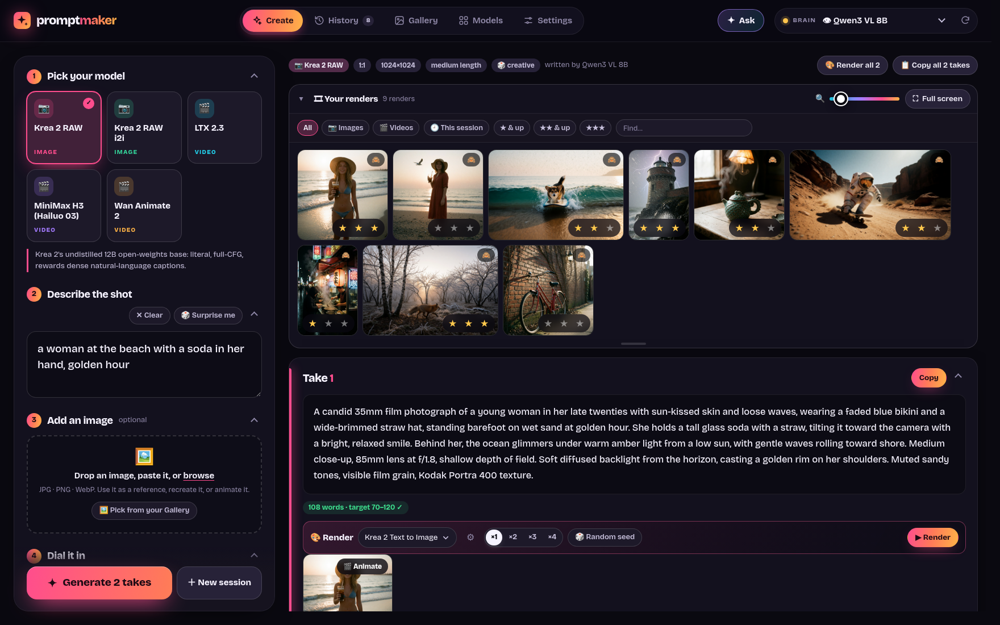
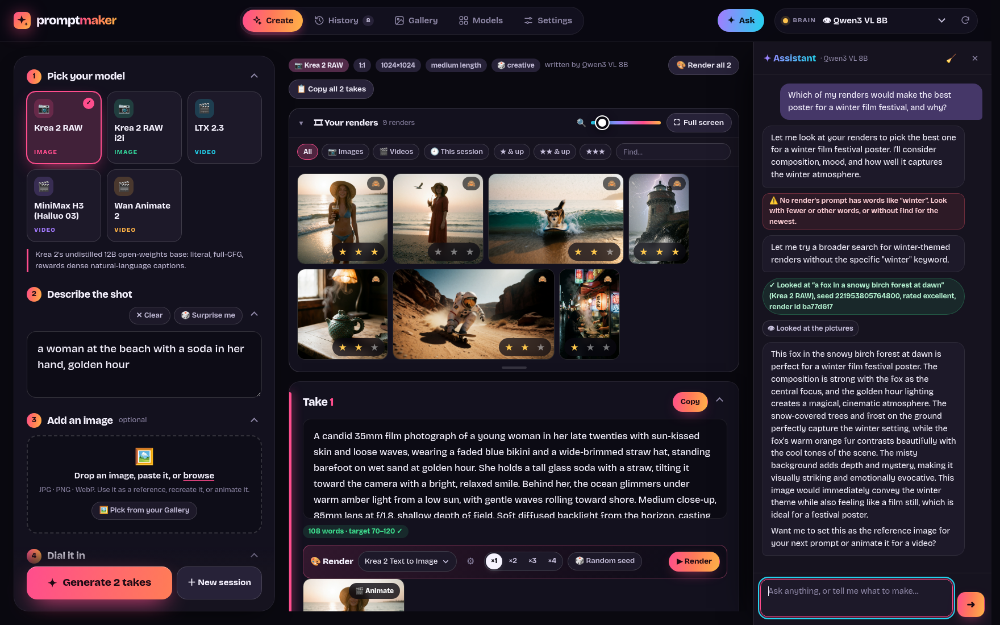
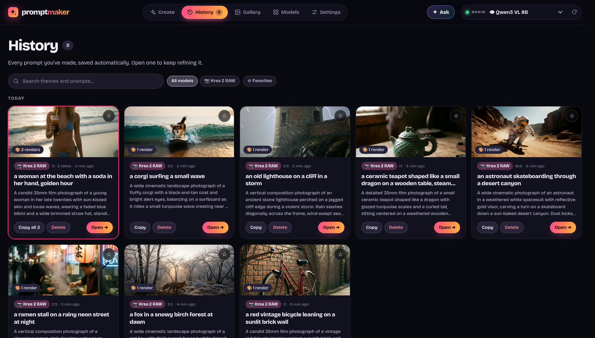
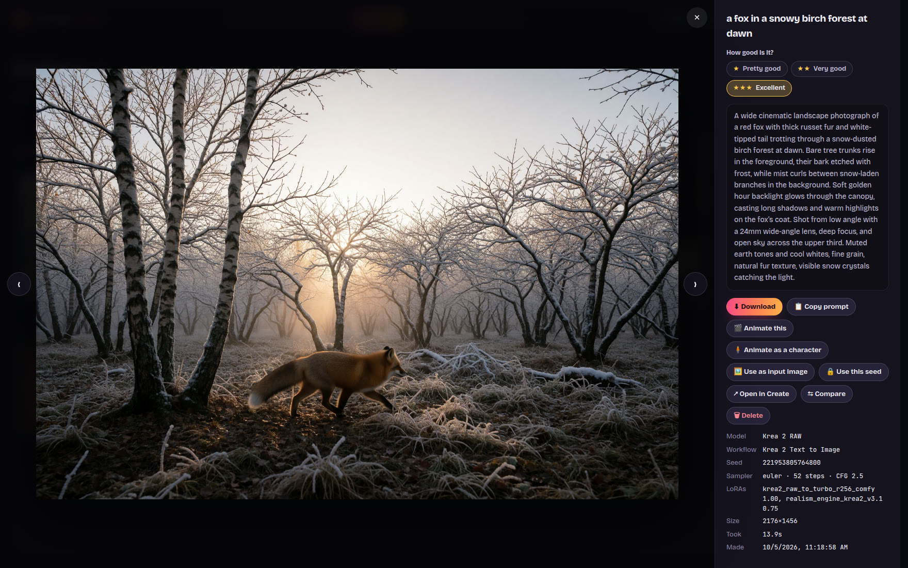
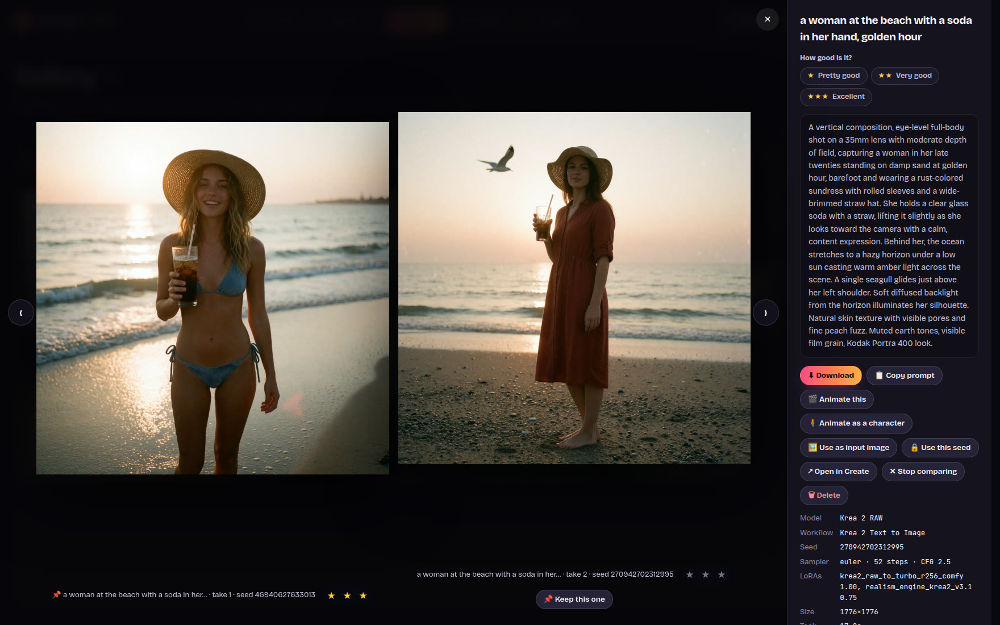
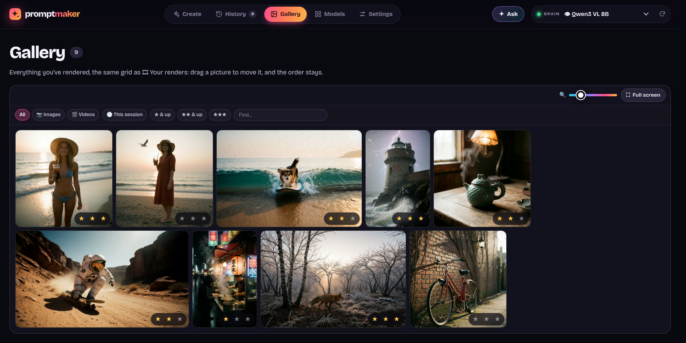
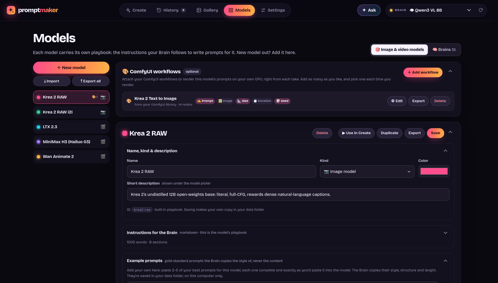

<div align="center">

# ✦ Prompt Maker

**Write the perfect prompt for any image or video model, from a theme, an image, or both. Then render it with your own ComfyUI workflows.**
Runs 100% offline on your own machine, powered by a local AI model (your **Brain**) in [LM Studio](https://lmstudio.ai) and, optionally, [ComfyUI](https://github.com/comfyanonymous/ComfyUI).




</div>

---

Every image and video model wants its prompts written differently:

- **Krea 2 RAW** likes dense, literal captions with skin-texture cues.
- **LTX 2.3** wants one flowing paragraph, with camera moves and sound written in.
- **MiniMax H3** expects a structured "shooting script" with timed shots and dialogue tags.
- **Wan Animate 2** wants a plain caption of the character and the setting, plus one line naming the moves of its motion video.

Prompt Maker keeps a **playbook for each model** and has your Brain write the prompt in exactly that style. You describe the idea, and it handles the dialect. Hook up your ComfyUI workflows and each prompt is one click away from the finished image or video.

## Contents

- [Features](#features)
- [How it works](#how-it-works)
- [Requirements](#requirements)
- [Installation](#installation)
- [Quick start](#quick-start)
- [Using Prompt Maker](#using-prompt-maker)
- [Rendering with ComfyUI (optional)](#rendering-with-comfyui-optional)
- [Target models](#target-models)
- [Choosing a Brain](#choosing-a-brain)
- [Settings](#settings)
- [Privacy & offline](#privacy--offline)
- [Your data](#your-data)
- [Troubleshooting](#troubleshooting)
- [Platform support](#platform-support)
- [Development](#development)
- [Contributing](#contributing)
- [Acknowledgements](#acknowledgements)
- [License](#license)

## Features

- **Theme → prompt.** Type an idea ("a woman at the beach with a soda in her hand"), pick a model, and get a finished prompt.
- **Image → prompt.** Drop in an image and use it three ways:
  - 🎯 **Reference**: borrow its look and blend it with your theme.
  - 🪞 **Recreate**: describe it so the model can reproduce it.
  - 🎬 **Animate**: video models only. The image is frame one, and the prompt describes what happens next.
- **Image alone.** Leave the theme empty and it suggests a prompt from the image.
- **🕺 Character animation (Wan Animate 2).** Give it a character image and a motion video: your character performs the video's moves, in a setting and from a camera angle you describe. The Brain watches the video (a sheet of its frames) to name the motion, and ComfyUI's own Wan Animate 2 templates are one click away, set up for you. A model file your ComfyUI lacks is one **⬇ Download** away, and a video's black bars one **✂️ Crop** away.
- **Model-aware settings.** Aspect ratio, resolution, duration (video) and prompt length. None of the resolutions fit? Pick **✎ Type your own size…**, enter a width and height and click **✓ Use**: Aspect turns to the size's shape (1280×720 → 16:9), so the render and the prompt are never sideways; the size stays in that model's menu as "Your size: …", even after a restart. Pick it again and **✕ Forget** takes it out.
  - Uploading an image **matches the aspect ratio to it** automatically.
  - Each model remembers your last choices.
- **Takes.** Generate 1–4 variations at once. Each take deliberately goes a different way (angle, lighting, setting, moment).
- **⏳ Queue.** No waiting for one to finish: while a prompt is cooking, **＋ Queue** (or `Ctrl+Enter`) lines up the next one, as many as you like. Each keeps the setup it was queued with, and its renders go on in ComfyUI while the next prompt is written.
- **Refine.** Tell a take what to change ("golden hour", "add a dog", "shorter") or tap a quick chip. Every version is kept and you can page through them, and hand edits are saved as versions too.
- **Live output.** Text streams in as it's written.
  - Word count against the model's ideal length (✓ when it's on target).
  - Timing for each take, plus a status while the model loads or thinks.
  - Progress shown in the browser tab title.
- **✦ Assistant with 🗂 jobs.** A creative partner that sees your renders and runs the whole app, anything you can click, and takes long jobs that run on their own, judge as they go and leave a log to review (*"8 stills of her in a noir café, same seed; animate the best in MiniMax at 20, 17, 13 and 10 steps. I'll be back in a couple of hours."*).
- **History.** Every prompt is saved automatically and grouped by day. You can search it, filter by model, star favorites, and reopen any entry to keep refining.
- **🎨 Render with ComfyUI (optional).** Attach as many ComfyUI workflows as you like to each model, then hit **▶ Render** on any take:
  - Pick any workflow you've saved in ComfyUI. Prompt Maker reads it directly, with no "Export (API)" step, and works out where the prompt, image, size, duration and seed go.
  - Watch live progress (and previews) right on the take.
  - **🎞 Your renders**, above the takes, holds every render you've made, newest first, with filters, so nothing gets lost below a long prompt. Drag the cards into your own order, and make the box as tall as you like, or full screen.
  - Rate the good ones: **★ Pretty good**, **★★ Very good**, **★★★ Excellent**.
  - **⇆ Compare** two renders side by side and **📌 Keep this one** until the best is left.
  - **🙈 Hide** the ones you don't want to see, without deleting them. **Delete** waits 8 seconds with **↶ Undo**.
  - Browse every result in the **Gallery**: the same grid as 🎞 Your renders, as tall as the window, in the same order you dragged them into. View any of them in a full-screen lightbox.
  - Chain models: turn a still into the input image for a video model with one click.
- **🧠 Brain profiles.** **Models → Brains** shows every LM Studio model: how it thinks, how fast it is here, and how its prompts did for each of your models. The Brain menu suggests the best ones for the model you're on, and a one-click **Quick check** tests a new model in about 20 seconds.
- **🔞 Adult content (optional, off by default).** A switch under **Settings → Master instructions** lets the Brain write explicit prompts between adults: plain anatomical language, who does what to whom kept exact, the act at the center of the shot. Each model can also have **Adult examples**, used only while the switch is on.
- **Model playbooks you own.** Add a new model, edit its instructions, or paste a model's official docs and let your Brain draft the playbook. Import and export models as `.json`.
- **Zero install fuss.** Plain Node.js with no dependencies: no `npm install`, no build step.
- **No terminal after the first start.** On Linux and Windows a launcher puts Prompt Maker in your app menu and starts it with your computer. **Settings → Services** starts and stops LM Studio, ComfyUI and Prompt Maker itself.
- **Private by design.** Nothing leaves your machine (see [Privacy & offline](#privacy--offline)).

## How it works

```
 You (browser) ──▶ Prompt Maker (localhost:5317) ──▶ LM Studio (localhost:1234)
                    • the target model's playbook      • your Brain (a local AI model)
                    • your theme / image / settings    • writes the prompt, streamed back
                                   │
                                   └──(optional)──▶ ComfyUI (localhost:8188)
                                                     • your workflow, with the prompt dropped in
                                                     • renders the image/video on your GPU
```

Prompt Maker builds a request out of three parts and sends it to LM Studio: its shared master rules, the target model's playbook and example prompts, and your theme, image and settings. The Brain's reply streams back into the page as your prompt. When you render, Prompt Maker makes a copy of the workflow you picked, puts the prompt (plus image, size, duration and a fresh seed) into it, and queues it on your ComfyUI. The result is saved alongside the take.

## Requirements

| What | Details |
|---|---|
| **Node.js 20.11+** | [nodejs.org](https://nodejs.org). Check with `node --version`. |
| **LM Studio** | [lmstudio.ai](https://lmstudio.ai), free for macOS (Apple Silicon), Windows and Linux. |
| **A Brain** (a local AI model) | Any chat model works. Use a **vision** model (tagged "Vision" in LM Studio) if you want to use images. See [Choosing a Brain](#choosing-a-brain). |
| **Hardware** | Enough memory to run that model. A small 4–8B vision model needs roughly 4–8 GB of GPU VRAM or Mac unified memory. CPU-only works, just slowly. |
| **A modern browser** | Chrome/Edge 111+, Firefox 121+, Safari 16.2+ |
| **ComfyUI** *(optional)* | Only for rendering. Any recent [ComfyUI](https://github.com/comfyanonymous/ComfyUI) running locally (default port `8188`). Node 22+ gives live progress; older Node versions poll instead. |

## Installation

### 1. Install Node.js

- **macOS / Windows:** download the LTS installer from [nodejs.org](https://nodejs.org).
- **Linux:** use your package manager, or [nvm](https://github.com/nvm-sh/nvm): `nvm install --lts`.

### 2. Install LM Studio and get a model

1. Install [LM Studio](https://lmstudio.ai) and open it once. This also installs its `lms` command-line tool.
2. Go to the **Discover** tab (🔍) and download a vision model, for example **Qwen3-VL 8B**.
3. Turn on the local server. Any of these works:
   - In LM Studio: **Developer** tab → **Start server** (it runs on port `1234`).
   - In a terminal: `lms server start`
   - Or skip this step: Prompt Maker shows a **▶ Start it** button when the server is off.

> **Tip:** LM Studio loads a model automatically the first time it's used, so you don't have to load one by hand. The first prompt just takes a few extra seconds.

### 3. Get Prompt Maker

```bash
git clone https://github.com/VincentAZ/prompt-maker.git
cd prompt-maker
```

No git? Click **Code → Download ZIP** on GitHub and unzip it.

There's nothing to install. Prompt Maker has no dependencies.

### 4. Start it

```bash
npm start
```

Then open **http://127.0.0.1:5317** in your browser.

On **Linux** you can use the launcher instead. It starts LM Studio's server if needed, starts the app and opens your browser, and if the app is already running it just opens it:

```bash
./start.sh
```

To stop Prompt Maker, press `Ctrl+C` in the terminal.

**On Linux, the first start sets everything up for you,** so you never need the terminal again:

- **Prompt Maker in your app menu.** Open it from there like any other app.
- **It starts with your computer** and keeps running in the background. It turns on LM Studio's server too, and comes back on its own if it ever stops. Switch this off or on in **Settings → Services**.
- **A Start button that works even when Prompt Maker is off.** If the page ever says *Prompt Maker's server isn't running*, click **▶ Start Prompt Maker**. The first time, your browser asks to open Prompt Maker: allow it (tick *Always allow*). The page keeps a copy of itself, so it opens even while the server is off.

**Start and stop everything from Settings → Services,** with no terminal:

| Row | What you can do |
|---|---|
| **Prompt Maker** | ■ Stop it. The page shows it stopped right away (the rows say *Stopped*) and offers ▶ Start Prompt Maker |
| **LM Studio** | ▶ Start its server, or ■ Stop it, which first unloads every model to free the GPU |
| **ComfyUI** | ▶ Start it, or ■ Stop it. It starts from its folder, the way Prompt Maker last saw you run it, or with live previews on (`--preview-method auto`); change the folder or the options under **ComfyUI** in Settings. Tick *Start ComfyUI along with it* to have it come up with Prompt Maker |

**■ Stop everything (frees the GPU)** stops ComfyUI, unloads LM Studio's models and turns its server off, then stops Prompt Maker. On Create, *ComfyUI offline* has a **▶ Start it** link too.

To undo all of it, run `./start.sh --uninstall`; `./start.sh --install` sets it up again. Logs: `journalctl --user -u prompt-maker -f`. macOS gets the same setup with its own launcher (coming).

On **Windows**, double-click **`start.bat`** in the app folder. It starts LM Studio's server if needed, starts the app and opens your browser. The first start also puts **Prompt Maker** in your Start menu and makes it start with your computer (without a window); **Settings → Services** switches that off, and `start.bat --uninstall` removes it. ⚠️ The Windows launcher and setup are new and have **not yet been tried on a real Windows PC**: if something doesn't work, start the app with `npm start` and please report it.

## Quick start

1. **Pick a brain.** Use the **Brain** menu at the top right: models marked 👁 can see images, and "loaded" means it's ready right now.
2. **Pick a target model**, for example *Krea 2 RAW*.
3. **Describe the shot.** Type a theme, or hit **🎲 Surprise me**. **✕ Clear** empties the box in one click (**↶ Undo** brings it back).
4. Click **Generate**, or press `Ctrl+Enter`.
5. **Copy** the prompt, or tweak it: type *"make it night time"* in the box under the take and press Enter.

## Using Prompt Maker

### Create

| Step | What it does |
|---|---|
| **① Pick your model** | The generator you're writing for. Its color follows you across the app. The five built-in models are there from the start; models you add yourself (see [Adding or updating a model](#adding-or-updating-a-model)) show up beside them. |
| **② Describe the shot** | Your theme: short or long, casual is fine. Optional if you add an image. |
| **③ Add an image** | Drop, paste (`Ctrl+V`) or browse. Click the image to see it full screen (click again for actual size). Picking from your Gallery? Drag the 🔍 slider for bigger thumbnails, or hit a tile's 🔍 to look closer. Then choose how to use it (below). On a character-animation model (Wan Animate 2) this step is **Character & motion**: the image is your character, and a **🕺 motion video** goes under it (see [Character animation](#character-animation-wan-animate-2)). |
| **④ Dial it in** | Aspect ratio, resolution (a preset, or ✎ your own width × height), duration (video), prompt length, number of takes, and how adventurous the writing is. |
| **⑤ Render it** | Optional, with ComfyUI. Pick the workflow that renders your takes, edit it or add one (see [Rendering](#rendering-with-comfyui-optional)). |
| **⑥ Then…** | Optional. Chain more steps, like still → video (see [Chains](#4-chains-build-your-own-pipelines)). |

**＋ New session** (next to Generate) starts a new session: it clears the theme, image and takes but keeps your model and dials. **↶ Undo** brings it all back, and everything stays in History.

**⏳ Queue: line up as many as you like.** While a prompt is cooking (or a batch is rendering), **＋ Queue** appears next to **■ Stop**; it (or `Ctrl+Enter`) puts the form, as it is right then, in line:

- **What you see when you click is what runs.** Each one in line keeps its model, theme, image and role, dials, takes, batch, and render setup (workflow, auto-render, LoRAs and sampler settings). Change the form afterwards to set up the next one; it won't touch those already waiting. (The Brain and the seed are the ones in use when its turn comes.)
- **They run in order**, each its own run and History entry. A take's renders go on in ComfyUI while the next prompt is written; a batch finishes its renders before the next starts.
- **Up next**, at the top of the results, lists them (the ＋ Queue button counts them): **✕** takes one out (with **↶ Undo**), **Clear** empties the line. Clicking twice on the same form within a second queues it once.
- **■ Stop** (or `Esc`) stops only the one running; the rest carry on. If one fails (LM Studio or ComfyUI went away, say), the line goes **⏸ on hold** so the rest don't fail the same way: fix it, then **▶ Carry on**.
- A chain (step ⑥) can't wait in line, since it may stop to ask you to pick. The line lives in the page: reloading it lets go of what's waiting (the page asks first).

**Image modes**

| Mode | Use it when… | What the prompt does |
|---|---|---|
| 🎯 **Reference** | You like the image's vibe | Carries its subject, palette, lighting and mood into *your* theme. |
| 🪞 **Recreate** | You want *that* image | Describes it faithfully so the target model can reproduce it. Your theme becomes changes. |
| 🎬 **Animate** | Image-to-video (video models only) | Treats the image as the first frame and describes the motion, camera and sound from there. |
| 🧍 **Character** | Character animation (Wan Animate 2) | The generator gets the image as the character to animate. The prompt describes how it looks exactly as it is, and where it is. It's the only way those models use an image, so there's nothing to pick. |

**How adventurous** (the Brain's *temperature*; the number is beside the slider) runs from 🎯 *precise* to 🌶️ *wild*. Lower values stick closely to your words, higher values get more inventive. Each model sets its own default.

**Prompt length** (*short / medium / long*) means something different for each model. For example, "medium" is about 70–120 words for Krea and about 160–260 for MiniMax. Every take shows its word count against that target.

**Keep it tidy:** every step on Create, every card in Settings and Models, and every take folds down to a one-line summary. Click its header or the ▾ button; Prompt Maker remembers what you folded. The technical parts start folded: in Settings the server addresses, how the Brain thinks and the master instructions; on a model's page its instructions, sizes, defaults and lengths. Seed, LoRAs and the sampler settings live under step ⑤ → **Advanced**.

**Nothing jumps.** On a wide window the steps and your takes sit side by side and each scrolls on its own, so new takes and renders never move the steps. While a take is being written, its buttons are already there, greyed out, and so is the tile for its render when auto-render is on; nothing below moves when the take is done. Fold a step or a take and the header you clicked stays where it is: the space it freed sits at the end until you scroll back up. A running job's bar (from the assistant) sits above the takes.

### Character animation (Wan Animate 2)

[Wan Animate 2](https://github.com/Wan-Video/Wan-Animate-2) makes a **character image** perform the moves of a **motion video**: a dance, a walk, a fight scene. The character keeps its look from the image, the moves come from the video, and the **setting, light and camera angle come from your theme**. Pick **Wan Animate 2** in step ① and step ③ becomes **Character & motion**:

- **🧍 Character:** drop, paste or pick an image, like any image. A clear, full shot of one character works best.
- **🕺 Motion video:** drop a video on the page, **browse**, or **🎞️ Pick a video from your Gallery** (any video you rendered). MP4, WebM, MOV and MKV work, up to 500 MB. It plays in step ③.
  - **The clip takes your character's shape**, as in Wan-AI's own code: **Aspect** (step ④) follows the character image, and ComfyUI crops the motion video to it at the center. (Until you add a character, Aspect follows the video.) When the two differ a lot, step ③ says which sides of the video get cropped: keep the moves near the middle, or use a character image in the video's shape.
  - Frame it like your character: full body to full body. A close-up character with a full-body dance (or the other way round) is the most common cause of a bad result.
  - **⬛ Black bars** (a webcam or screen recording inside a wider frame, a letterboxed film) would count as part of the video. Step ③ spots them and offers **✂️ Crop the bars**: a copy with just the picture, sound kept.
  - **✂️ Trim** (under the video) uses just part of a long video, cut to the frame, in a big window of its own:
    - **The frame at the playhead** fills the window, with its time and number below it (*0:05.92 · frame 72 of 1159*).
    - **The timeline** is a strip of the video's frames. Press and drag anywhere to move the playhead. The part you keep is lit between two handles, and the rest is dimmed: drag a handle to move the start or the end, and the frame it lands on shows as you go.
    - **Step one frame** with **‹ frame / frame ›** or `←` `→` (`Shift` for a second).
    - **⇤ Start here** (`I`) and **End here ⇥** (`O`) mark the frame you're looking at, or type the times. It says how many frames the part is.
    - **▶ Play part** (`Space`) plays just that stretch, over and over.
    - It starts out as long as the picked workflow animates (81 frames for the Distilled template). **✂️ Use this part** swaps in a copy of just those frames, sound kept.
  - The video's length, size and frame rate and its buttons sit in a bar under it, so nothing covers the picture.
  - The clip is as long as the video, and its frames are used one for one. Step ③ shows its length, shape and frame rate. Above 30 fps (many phones film at 60 or 120), it takes that much longer to render: **Use a 24 fps copy** swaps in a copy at 24 fps, with the sound kept.
  - **Phone videos (H.265/HEVC)** often don't play in the browser. ComfyUI uses them as they are; for the page, Prompt Maker makes a small upright preview, so you still see it, Aspect still matches it, and the Brain still sees the moves. The preview, the 24 fps copy and the crop need [ffmpeg](https://ffmpeg.org) on this computer (most Linux systems have it). Without it, the video still renders; the Brain then goes by your theme for the moves.
- **② The theme** says where the character is and from where the camera sees it: *"on a rooftop at dusk, low angle, three-quarter view"*. Leave it empty and the Brain picks a setting that suits the character.

**What the Brain writes.** The prompt is in Wan Animate 2's own format: a `Character appearance description:` line (looks only: no actions or emotions), a `Background description:` line (the place, the light, the camera), and a `Motion:` line naming the moves. A 👁 vision Brain sees your character and a **contact sheet of the motion video** (6 frames in order, with their times), so it describes the character faithfully and names the motion from the video. A text-only Brain still works: it goes by your theme.

**Rendering it.** In step ⑤, click **＋ Add workflow**. **⭐ ComfyUI's templates for Wan Animate 2** come first, straight from your ComfyUI (update ComfyUI if they're missing):

| Template | What it does |
|---|---|
| **Wan Animate 2: Motion Transfer** | The full model with the LightX2V LoRA (6 steps). It follows the whole motion video, however long, in 81-frame pieces. |
| **Wan Animate 2 Distilled: Motion Transfer** | The distilled model (10 steps). It makes the first 81 frames of the motion video. |

Prompt Maker sets them up for you: the look and setting go to the prompt, the **Motion** line to the pose prompt, your character to *Load Image*, the motion video to *Load Video*, and the size from step ④. It also **fixes a mistake in ComfyUI's template**: its pose window starts and ends at 0, which leaves the motion video unused; Prompt Maker sets the end to 1.0 and says so in the setup. The templates also save a side-by-side of the render and the motion video; Prompt Maker leaves that out, so only your render lands in the Gallery. While a long video renders in pieces, the progress line says which piece it's on (*piece 3 of 15*), and the percentage counts the whole render.

**How much of the video.** A workflow may animate only part of a long motion video: the Distilled template makes 81 frames (3.4 s at 24 fps), as one piece that can't be chained on. When yours is longer, step ⑤ says how much the picked workflow makes, and which of your workflows does all of it. Or use **✂️ Trim** in step ③ to pick the stretch you want.

Your own Wan Animate 2 (or SCAIL) workflows work too, from ComfyUI or a file. One that **renders in pieces** (copies of the same part, each making the next stretch of the video) gets the same prompt and size in every piece, and if it also saves its first piece on its own, only the full video is kept. The setup says so.

**Whose background.** A SCAIL 2 workflow can keep either background, and step ③ shows a **Background** choice for it, under your motion video: **🖼️ From your picture** brings your picture to life (its character moves like the person in your video, its background stays), and **🎬 From your video** puts your character in place of the person in your video (the video's background stays). It starts at the workflow's own setting (a *character replacement* workflow keeps the video's), and your pick stays with the workflow. (Wan Animate 2's own templates keep neither: their background comes from the prompt's *Background description* line.)

**Any length.** A workflow built as a chain of pieces (SCAIL 2's *Base* + *Extend*: 81 frames each, every next piece carrying on from the last 5 frames of the one before) makes only as much as it has pieces, about 6.5 s for two. Prompt Maker adds pieces like the last one, as many as your motion video (or the part you trimmed) needs: a 48 s clip at 24 fps takes 16. Each new piece carries on from the one before, they're all joined into one video, and the model and LoRAs are loaded once for all of them. Up to 50 pieces (about 2½ minutes at 24 fps).

**Long videos say how far they are.** A video made in pieces shows which piece it is on (*piece 2 of 5*) and one percentage for the whole render, instead of jumping to 100% with every step. The size shown for a render is the size it really came out at. If the motion video's sound is shorter than the video, the video keeps its full length and the rest is silent.

**Long videos don't run out of memory.** ComfyUI saves each piece as its own short video, and Prompt Maker joins them into one, with your motion video's sound (the progress line says *Joining the pieces into one video…*). Joined inside ComfyUI instead, a long video needs a lot of memory all at once right at the end (13 GB more for 35 pieces), and ComfyUI could be shut down for running out of memory just as the render finished. Joining needs ffmpeg; on a computer without it, ComfyUI joins the pieces as before.

**Models it needs.** Each template needs five model files in ComfyUI (the Wan Animate 2 model, a LoRA, the text encoder, a CLIP vision model and the VAE). If your ComfyUI lacks one, step ⑤ names it and where it goes, with **⬇ Download** (see [Missing models](#missing-models)). A file that sits in a subfolder (`checkpoints/wan-2.1/sam3.1….safetensors` where the workflow says `sam3.1….safetensors`) is found there on its own.

The setup's **🎛️ Sampler** settings add Wan Animate 2's own controls:

| Setting | What it does |
|---|---|
| **Pose strength** | How strongly the motion video drives the moves. 1 is as trained; lower loosens it, higher follows it harder. |
| **Pose start / Pose end** | When, in the sampling steps (0–1), the motion video counts. An end around 0.7 keeps the moves but loosens fine detail. |
| **Character strength** | How closely the character keeps the image's look. Below 1 lets the prompt restyle it (a new outfit); above 1 holds it tighter. |

**From a render.** In the lightbox, **🧍 Animate as a character** sends a still to Wan Animate 2 as the character, and **🕺 Use as motion video** sends a video render as the moves. A chain can do it too: a **Then** step on Wan Animate 2 uses the still before it as the 🧍 *character* and the motion video in step ③.

The motion video is kept with the take (History puts it back), and deleting the History card deletes it, here and in ComfyUI.

### ✦ The assistant



Your creative partner, on from the start: its panel opens with the app (on a wide screen) and stays as you leave it. **✦ Ask** in the top bar (or **Ctrl+K**) opens or closes it. The page takes all the room beside the panel and nothing lies under it: on a smaller window the Create page goes to one column while the panel is open. The top bar's menus (Brain, 🎨 Rendering) open over it. It runs on your **Brain** (the same LM Studio model, so it stays offline):

- **Ask what it thinks.** *"Which of these renders do you like better?"*, *"Should the princess be in the high tower or the dungeon?"*, *"Based on this prompt, what aspect ratio should it be?"* It gives a real opinion with a reason, and offers to act on it.
- **It sees.** It looks at renders (and frames of videos), the image in step 3, the lightbox, 🎞 Your renders, the Gallery, and pictures and videos in any folder on your computer. The chat shows a 👁 strip of what it looked at. Seeing needs a 👁 vision Brain; the pictures are never saved, only their names.
- **It finds your work.** *"Check out the renders of the woman walking around her apartment"*: it searches every render you ever made by the words of its prompt (typos are fine) instead of only the newest. *"They're in my renderings folder"*: it finds a folder by its name or one close to it ("renderings" finds "renders"), first Prompt Maker's own renders folder and ComfyUI's output, then anywhere in your home folder and on your other drives (USB sticks, a second disk). It can look for any file or folder by name too, and looks before it asks you where something is.
- **💻 Let it use your computer (opt-in).** Switch on **Settings → ✦ Assistant → 💻 Let the assistant use my computer** and click **Save settings**, and it can also work outside Prompt Maker: run programs and commands (*"open these in GIMP"*, *"make a folder Best of October and copy my excellent renders into it"*), and read and write any file. It doesn't ask each time, except before anything that may delete, move, copy over or replace a file, however the command is written (`/bin/rm`, inside `bash -c "…"`, `> file`, code handed to Python or PowerShell), and before a command that talks to Prompt Maker itself: it shows you the command and waits for **▶ Run it**. Off by default; only you can switch it (the assistant can't press that switch), and only the app on this computer can use it.
- **It knows what you're looking at:** the takes on screen (their full text), the render open in the lightbox, this session's runs and their ratings, renders in progress.
- **Tell it what to make.** *"Set up a 9:16 Krea shot of a surfer at golden hour, 2 takes, film grain LoRA at 0.6, then render them."* Or *"use seconds 12 to 15 of the motion video and crop its black bars."*
  - It runs the app with the same controls you have: model, theme, dials, workflow, sampler settings (steps, CFG, sampler, scheduler, denoise), LoRAs, seed, takes, renders, refining, animating, motion videos (trimmed, cropped, 24 fps) and characters (Wan Animate 2), chains, History, playbooks, ratings, the lightbox, cancelling renders, the Brain, and settings (adult content, thinking, top-p, max tokens, ComfyUI cleanup).
  - **And anything else on screen.** It reads what the app is showing (every page, dialog, fold and setting) and presses, types and picks there like you do: *"make a batch called Hero shots, 6 images, a different prompt each"*, *"add my ComfyUI workflow z_image_base to Krea as a second workflow"*, *"set the LM Studio address and save"*, *"start ComfyUI"*. Pressing anything that deletes or removes asks you first.
  - **It picks the best for you.** *"Pick the best render for a winter poster and use it as the reference"*: it looks at them, says which and why, and puts it in step ③ (as a reference, the first frame of a video, or the character).
  - Each step shows in the chat ("✓ Model → Krea 2 RAW") and on screen.
  - **■ Stop** or **Esc** stops it.
- **🗂 Give it long jobs.** *"Use the 4 pictures in folder ABC to do 2 takes each, the first with low temperature, the second with high. Skip any problems and log them for me to review later."*
  - **Jobs judge as they go.** A job can pick the best of what it has made so far and carry it on (animate it, or make it the character), and change sampler settings between renders. *"Generate 8 images with Krea of a woman in a noir coffee shop, a different prompt each, same seed. Then pick the best for 'a stranger sits down next to her' and make 4 MiniMax videos of it, steps from 20 down to 10."* becomes one job: 8 stills, the pick, then the video at 20, 17, 13 and 10 steps.
  - It looks in the folder (a full path, `~/…`, or just its name, found anywhere in your home folder or on your other drives), plans the job, and starts it. The job then runs **on its own**, one item after another, while you do other things. Its tools don't pull you back to Create.
  - Anything that fails is **skipped and logged**, and the job goes on. If the same thing fails 3 times in a row (LM Studio off, ComfyUI down…), it pauses so you can fix that first.
  - **🗂 Job** in the top bar shows progress (item 3 of 8). On Create, a strip says a job is using the page: changes you make there go into it.
  - The **Jobs** window has each job's log: ✓ done or ⏭ skipped (with why), the picture (click it to look closer), **👁 View** for what it rendered and **↗ Open** to bring it onto Create. **Only the skipped ones** filters the log, and **↻ Retry skipped** tries them again. You can **⏸ Pause** (after the current item), **■ Stop now**, **▶ Resume** or **🗑 Remove** (what the job made stays in History).
  - Jobs survive reloads: each step is saved. If the page reloads or closes mid-job, the job pauses, the item it was on is marked to check, and a toast offers **Resume**.
  - Ask *"how did the job go?"* and it tells you what was done and what was skipped, and why. Once you've seen a finished job's log, the pill goes away; **🗂** in the assistant panel opens the Jobs window any time.
- **It keeps working in a long session.** Only the newest pictures it looked at are kept in the conversation, so asking it to look at renders many times doesn't make the conversation too big to send. A long file or command output keeps its start and its end. If it runs out of room in the middle of a step, it says so (*say "go on"*) instead of showing half a step as text.
- **Deleting asks you first.** It can delete a prompt or a render when you ask, but only after you click **🗑 Delete** in the chat; **Keep it** says no. Any button that asks **Sure?** (↺ Reset to built-in, ■ Stop everything, clearing the line…) is yours to answer too: it asks you in the chat before the second press. A ☁️ cloud Brain still asks you before it's used, and only you can answer that question: the assistant doesn't get its buttons, so it can't click **OK, use it** or **Don't ask again** for you.

The conversation is kept in your data folder; 🧹 clears it. It works best with a model that supports tool calling and vision (Qwen 3/3.5/3.6 VL, Gemma 3+, Llama 3.2 Vision).

Some community fine-tunes come with a chat template that LM Studio can't fill in once the app's controls are sent along ("Error rendering prompt with jinja template"). The assistant handles those on its own: it describes the controls to the Brain in writing instead and reads back what the Brain asks for, so nothing needs changing in LM Studio. It remembers which Brains need this, so only the very first question to such a Brain takes a moment longer, and it reads what they write even when it comes out a little off (in a code block, several steps at once, Gemma's own notation).

### Refine and versions

- Type a change in **Tweak it…** and press Enter, or tap a chip like ✂️ *Shorter*, 🎞️ *More cinematic* or ⚡ *More dynamic motion*.
- Every refine adds a version. Page through them with **‹ ›**.
- You can edit a prompt by hand. Click **💾 Save edit**, or page away and it's saved automatically.
- **Stop** (■ or `Esc`) cancels a run but keeps any takes that already finished. Runs waiting in line (see [Queue](#create)) carry on.

### History



Everything you generate is saved automatically:

- **Find things:** search themes and prompts, filter by model, or show only ★ favorites.
- **Pick up where you left off:** click a card to reopen it exactly as it was made: model, theme, image and its role, aspect, resolution, duration, length, temperature, takes and batch, plus how it was rendered (workflow, renders per take, seed and seed mode, LoRAs and their strengths, sampler settings). Keep refining, or Generate / Render again the same way. The card that's open on Create is ringed in History, which scrolls to it.
- **Delete gives you a few seconds to undo, then it's for good.** Click **Delete**, then **Sure?** (it says so when rated renders go too; a double click only asks, it doesn't confirm). The card stays in place, dimmed, for 8 seconds with **↶ Undo** on it and in the toast; a render deleted from the full-screen view works the same way. After that, or when you close the page, it's gone. Deleting a card removes its prompts, its input image and motion video (unless another card, or a prompt waiting in line or being written, uses the same one) and its renders, along with ComfyUI's copies of them: the files in its output folder, the image uploaded to its input folder, and the job (with your prompt in it) in ComfyUI's history. A render you made yourself in ComfyUI with the same prompt is yours and stays. If the Create form still shows the deleted card's theme, picture or motion video, it lets go of them too. Quotes of it in the assistant chat become "[deleted]", and a video made from a deleted still keeps its own frame but loses the link and the still's prompt. On start-up, Prompt Maker also removes any render, image or video no History card uses anymore; a picture or motion video still waiting in the Create form is never one of them.

### Keyboard shortcuts

| Keys | Action |
|---|---|
| `Ctrl` / `⌘` + `Enter` | Generate (while one is cooking: queue the next) |
| `Tab` (first press) | **Skip to your results**: jumps past the steps |
| `←` `→` on the model cards | Move between models (they are one Tab stop) |
| `Esc` | Stop the current run (when a dialog, a menu or the assistant has it, it only closes that) |
| `Enter` (in *Tweak it…*) | Refine that take |
| `Ctrl` / `⌘` + `V` | Paste an image |
| `Ctrl` / `⌘` + `K` | Open or close the assistant |
| `←` `→` (full-screen view) | The render before or after |
| `1` `2` `3` (full-screen view) | Rate it ★, ★★ or ★★★; `0` takes the rating off |
| `Shift` + `←` `→` on a render card | Move the card in 🎞 Your renders or the Gallery |

## Rendering with ComfyUI (optional)



Prompt Maker is great on its own. If you run [ComfyUI](https://github.com/comfyanonymous/ComfyUI), it can also **render** your prompts, using your own workflows on your own GPU.

### 1. Attach a workflow to a model

1. Start ComfyUI as usual. Prompt Maker expects it at `http://127.0.0.1:8188`; change that in **Settings → ComfyUI**.
2. On **Create**, pick a model (say *Krea 2 RAW*) and click **＋ Add workflow** in step ⑤. (Or do it in **Models**, which lists every model's workflows.)
3. Choose where the workflow comes from:
   - **From ComfyUI** lists every workflow you've saved in ComfyUI. Click one. For some models (Wan Animate 2), **⭐ ComfyUI's own templates** for it come first: one click, and it's set up.
   - **Upload a file** accepts a saved workflow, an *Export (API)* file, or a workflow exported from Prompt Maker.
4. Check the **setup**. Prompt Maker reads the workflow and suggests where things go:

   | Slot | What Prompt Maker puts there |
   |---|---|
   | ✍️ **Prompt** | The take's prompt. It picks the text that feeds the sampler's *positive* input, never the negative. You can send it to several inputs. |
   | 🖼️ **Image** | The take's image, uploaded to ComfyUI (for image-to-image or image-to-video). |
   | 🕺 **Motion** | Character animation only: the take's `Motion:` line (Wan Animate 2's pose prompt). The rest of the take goes to ✍️ Prompt. |
   | 🎞️ **Video** | Character animation only: the take's motion video, uploaded to ComfyUI (a *Load Video* node). |
   | 📐 **Size** | Width and height from the take's resolution and aspect, rounded to a multiple of 8/16/32/64. An *aspect ratio* input gets its closest option. |
   | ⏱️ **Duration** | Seconds, or a frame count worked out from the frame rate (with 8n+1 or 4n+1 rounding for LTX and Wan-style models). |
   | 🎲 **Seed** | A fresh random seed every render, unless you lock it. |

   Anything you don't map stays exactly as the workflow has it. Add as many workflows per model as you like, for example a fast draft workflow and a slow hi-res one. If the workflow loads a model file your ComfyUI doesn't have, the setup says which (see [Missing models](#missing-models)).

5. Tune the **🎛️ Sampler** settings if you like. Prompt Maker shows the workflow's own **seed, steps, CFG, sampler and scheduler** (every sampler in it, two-stage ones included), plus Wan Animate 2's pose and character strengths, and lets you change any of them; **↺** puts a value back.
   - A **CFG of 1 is locked**, because distilled, turbo and lightning models need it. **🔒 unlock** is there if you really mean it.
   - Leave *New random seed every render* on, or turn it off to use a fixed seed.

**Changed a workflow in ComfyUI?** Prompt Maker renders from its own copy, saved when you added the workflow. When you save the workflow again in ComfyUI, Prompt Maker notices (next time you come back to its tab) and shows **↻ Changed in ComfyUI · Update** in step ⑤, on the take's render bar and in **Models**. One click pulls in the new version and keeps your setup: where the prompt goes, the size and seed slots, and your sampler tweaks. If a part of your setup no longer fits (say the prompt node was replaced), the setup opens so you can check it. **↻ Update from ComfyUI** in a workflow's setup does the same any time. Workflows you uploaded as files offer **↻ Update from a file** instead.

### 2. Render

Step **⑤ Render it** on the Create page is your control center:

- **Pick the workflow** your takes render with. Prompt Maker remembers it for each model.
- **⚙ Edit** changes its name, inputs and sampler settings; under **Advanced**, chips show what it will use (sampler, steps, CFG), and clicking them jumps to those settings. **＋** adds another workflow. **Delete workflow** is in the edit dialog.
- **Auto-render every new prompt** sends each new or refined take to ComfyUI as soon as it's written.
- **Batch** (folds open like Advanced) holds your saved batches, for images and videos alike. Each one stands on its own:
  - **a name** you give it, e.g. *Hero shots* or *Explore*,
  - **how many** images or videos (any number up to 50),
  - **🔁 One prompt** (one prompt, rendered that many times with a new seed each) or **🔀 A different prompt each** (that many different prompts, each rendered once).

  **Generate runs** picks what the next **Generate** does: no batch, one of your batches, or **all of them, one after another**. Each batch is its own run, with its own takes and its own History entry, tagged 🎞 with its name (search History by it). The button says what will happen and counts along while it renders. **■ Stop** (or `Esc`) cancels the rest and keeps what finished. **✕** deletes a batch (**↶ Undo** puts it back where it was, and keeps any batch you made or changed in the meantime). While a batch renders, History cards can't be opened on Create, so the batch always renders its own takes. While a batch is picked, it decides the number of takes; a chain (step ⑥) has its own takes and renders, so Batch hides while you build one.

Every take also has a **🎨 Render** bar:

- **The workflow menu** is the same choice as step ⑤; change either one. **⚙** opens its sampler settings.
- **×1–×4**: render several at once, each with its own seed. (For more, use **Batch** in step ⑤.)
- **🎲 New seed / 🔒 Seed**: lock the last seed to try prompt tweaks on the same composition.
- **▶ Render**: live progress shows on the tile (queue position, node, step, %), with previews if ComfyUI was started with `--preview-method auto`. **✕** cancels.
- **🎨 Render all** does every take in one go.

Click any result to open the **lightbox**, where you can:
- rate it (the stars come first, right under the title) and read its prompt, seed, size and timing,
- **⇆ Compare** it with another: it stays on the left while **← →** browse the others on the right, each with its own stars. **📌 Keep this one** moves the one on the right to the left, so you can work through a set and end with the best. **✕ Stop comparing** goes back to one at a time,
- **download** the file,
- **render again** with a new seed,
- **🎬 Animate this** (see below), or **🖼️ use it as the input image** for your next prompt,
- or delete it.



### Missing models

A workflow can load a model file your ComfyUI doesn't have yet: a checkpoint, a LoRA, a CLIP vision model… ComfyUI would refuse it. Prompt Maker checks before every render, so nothing is half-done:

- **Step ⑤ says which files are missing** for the picked workflow, and the ComfyUI folder each goes in (`models/clip_vision`, say). A render started anyway stops with the same list.
- **⬇ Download** gets one (or **⬇ Download all**) straight into that folder, with a progress bar. It uses the link the workflow carries: ComfyUI's templates and most shared workflows list a download link for each model. It runs in Prompt Maker's server, so it goes on through a reload; **✕** stops it. As soon as it's done, the notice goes and the workflow renders.
- **Only from Hugging Face**, and only when you click. A link to another site is shown for you to open yourself, and a workflow with no link for a file says so: get it there (or where the workflow came from) and put it in that folder.
- **A file in a subfolder** (the workflow says `sam3.1.safetensors`, your ComfyUI has `wan-2.1/sam3.1.safetensors`) is found there, with nothing to do.
- **ComfyUI skipping part of a workflow** (an output that fails its checks) also stops the render, with ComfyUI's reasons in short. Before, the render ran without its result.

### Seed

Step ⑤ has a **🎲 Seed** row for the picked workflow, with ComfyUI's four modes:

| Mode | What each render gets |
|---|---|
| 🎲 **Random** | A new random seed. The row shows the last one, and **🔒 Keep it** switches to Fixed with it. |
| 🔒 **Fixed** | The same seed every time. (×2 renders in one go use the seed and the seed + 1.) |
| **＋1** | The seed, then one higher each render. |
| **−1** | The seed, then one lower each render. |

- **Type any seed** in the box. **↶** puts back the last render's seed, and **🎲** rolls a new one.
- **The hint says what comes next,** e.g. *Next render: 1000, then 1001…*
- **Each take's render bar shows the mode** (e.g. 🔒 Seed 4211). Click it to jump to the row.
- **In the lightbox,** **🔒 Use this seed** fixes the seed of a render you liked, and **🎲 Render again** always uses a new one.
- **Seeds are saved per workflow,** and renders started together never share one.

### Denoise (image-to-image)

When the picked workflow takes an image and has a **denoise** setting, step ③ shows a **🎚️ How much to change your picture** slider right under your image. Lower keeps more of your image, higher changes more, and a hint says which. **↺** puts the workflow's value back. It's saved with the workflow, like its other sampler settings.

### LoRAs

Step ⑤ shows the **🧬 LoRAs** of the picked workflow:

- **The workflow's own LoRAs** (LoRA loader nodes, and rgthree's Power Lora Loader) are listed with a switch and a strength slider, −2 to 2, or type any value.
  - **Switching one off** leaves it out of the render entirely, so its file isn't even loaded.
  - **Strength 0 counts as off**: the LoRA is left out the same way, so it can't change the render.
  - **↺** puts the workflow's strength back.
- **＋ Add LoRA** lists only the LoRAs for the selected model. Prompt Maker matches the model to its folder in ComfyUI's `models/loras` (e.g. `krea2/` for Krea 2 RAW, `LTX_2.3/` for LTX 2.3). If the match is wrong, pick the folder in the list. Search narrows it down, and the LoRA goes in at strength 1.
- **Added LoRAs go in right after the workflow's model loader,** so there's nothing to wire up in ComfyUI.
- **A workflow that renders in pieces** (like SCAIL 2, where each piece loads its own copy of the same LoRAs) shows each LoRA once, marked *×2 pieces*: its switch and strength set every piece.

Your LoRA choices are saved with the workflow in your data folder. Every render records the LoRAs it used, shown in its lightbox.

### 3. Turn a still into a video

Hover any still you rendered and click **🎬 Animate** (it's also in the lightbox):

- **The still becomes the first frame.** Create switches to your video model (the one you used last) and picks 🎬 *Animate*. The theme box asks **what happens**. Leave it empty and the Brain picks fitting motion.
- **It stays consistent.** The Brain sees the frame and also gets the still's prompt, so people, clothes and places are described the same way.
- **Full quality.** ComfyUI gets the original render file as the first frame, not a re-compressed copy.
- **It remembers where it came from.** The video's results, History card and lightbox link back with **⬑ from Krea 2 RAW · take 1 · seed …**.

You'll need an image-to-video workflow (one with a *Load Image* node) on the video model. Step ⑤ warns you if the picked workflow can't take the frame.

### 4. Chains: build your own pipelines

A chain runs several steps in a row, each one continuing from the renders of the step before, like a still that becomes a video. Build it in step **⑥ Then…** on the Create page:

1. Set up step 1 as usual (model, theme, dials, and a workflow in step ⑤).
2. Click **＋ Then…** to add a step. Pick its model, how it uses the image (🎬 *first frame*, *reference* or *recreate*; 🧍 *character* on Wan Animate 2, which also uses the motion video in step ③), **what happens** (optional; empty lets the Brain choose), its workflow, takes and renders.
3. Between steps, choose **⏸️ Let me pick** (the chain waits while you pick the best renders) or **⚡ Auto** (every render goes on).
4. Click **Run chain**. The line above it says what you'll get, e.g. *2 stills → you pick → videos*.

While a chain runs, a strip above the results shows every step. Click any thumbnail to see that step's takes.

- **At a ⏸️ step,** tick **☐ Pick** on the renders you like and click **Continue ▶**. Pick several to make one video from each.
- **Change a step while you pick,** for example what happens next. Continue uses the chain as you see it.
- **Stop (■ or Esc)** ends the chain. Finished steps are kept.
- **Reopen a run any time from History.** Its cards are marked ⛓. You can send more stills on from it later.

**💾 Save as a chain** keeps your steps, so you can run them again with a new idea. Saved chains show up under the steps, next to the starter chains *Still → Video* and *One still, 3 motions*. **⤒** exports one to share, and **⤓ Import** adds one from a file. A chain from someone else picks your matching workflows by name, or asks you to choose.

> Chains continue from images for now: a video can't feed the next step yet. Extending a clip from its last frame is coming next.

### 5. Your renders and the Gallery



**🎞 Your renders** sits above the takes on Create. It holds a card for every render you've ever made, from every run and batch, all in one grid, newest first. It keeps them when you reload the page or restart Prompt Maker.

- **Live.** A render shows up the moment it starts, with its preview, progress and **✕ Cancel**, and stays when it's done.
- **Filters:** 📷 Images or 🎬 Videos, **🕘 This session** (only what you made since Prompt Maker last started), **★ & up**, **★★ & up** or **★★★**, a model, and **Find…** to search the words of the prompt. The count says how many show (*12 of 183*). The filters are remembered, except Find.
- **Arrange them your way.** Drag a card where you want it and the others slide aside to make room: over a card's left half it goes before it, over its right half after it. On a touch screen, hold it a moment first; with the keyboard, **Shift + ←** or **→** moves the card you're on. Your order is saved in your data folder, so it stays. New renders come in first, ahead of the ones you've placed. **↺ Newest first** goes back to newest first.
- **As big as you want.** Drag the box's bottom edge to make it taller or shorter. It keeps that height while renders arrive, so the takes below don't move. **🔍** makes the pictures bigger or smaller, up to one picture as tall as the box. **⛶ Full screen** gives the box the whole window (**Esc** goes back). **▾** folds it away. All of this is remembered.
- **A dragged card is never left hanging.** Let go outside the window, or switch to another program mid-drag, and the card drops where it was.
- **In the Gallery, a hidden one is marked** (dimmed, with **👁 Show** on it), so you can tell it from the others and bring it back there too.
- **🙈 Hide** one you don't want in the box: hover it and click **🙈** at its top right (**↶ Undo** brings it back). Nothing is deleted; it stays in History, the Gallery and its take. **🙈 Hidden (n)** in the filters shows the ones you hid; **👁 Show** puts one back.
- Hover a card for its prompt, model, take, seed and when it was made. Click it to see it full screen: **← →** browse what the filters show, and **↗ Open in Create** puts its take back on the stage.

**Rate your renders** so the best ones are easy to find again: **★ Pretty good**, **★★ Very good** or **★★★ Excellent**.

- Click the stars on a render in **Your renders** (hover a render to see them), or the buttons at the top of the lightbox's side panel, or press **1**, **2** or **3** in the lightbox. Clicking the rating it already has takes it off (or press **0**).
- Renders you marked ♥ favorite before ratings count as ★★★ Excellent.

Every render also appears in the **Gallery** tab. It *is* 🎞 Your renders, given the whole page: the same cards, stars, filters, 🔍 size, ⛶ full screen and drag to arrange, with one order shared by both (move a card in the Gallery and it's moved on Create too). The Gallery always shows everything, the renders you 🙈 hid included. The newest render becomes the thumbnail of its History card.

- After you close the lightbox, the Gallery rings the render you looked at last, so you don't lose your place.
- Video tiles show a still of their first frame and play while you hover them.
- **🎨 Rendering** in the top bar shows while anything renders, with how many are left. Click it for every render still going, from any take (also ones you moved off the stage, started in another tab, or before a reload): its live preview and progress, **Open** to bring its take back with live tiles, **✕ Cancel**, and **Cancel all**.
- **If ComfyUI crashes mid-render** (it ran out of memory, say, or was closed), the render stops within seconds and says so: *ComfyUI stopped before this render finished*, instead of staying stuck at 0% · Starting… Close other big programs (games especially) and render again. A ComfyUI that is only too busy to answer (a heavy step can do that for minutes) is waited for: the render is given up only after 15 minutes without an answer.
- **Many renders at once don't slow the page.** However many are going, Stop, Cancel, Generate and saving settings answer right away. **✕ Cancel** on a ×2–×4 render also stops the ones that hadn't started yet, whenever you click it.
- **Renders survive a page reload.** A render keeps going in Prompt Maker's server if you reload or close the page; when the page comes back it shows the take again with the render still live. Only **✕ Cancel** on a running tile (or **■ Stop**) stops it. A chain or batch run is steered by the page, though: after a reload, the step that was rendering finishes, but the next ones don't start.
- **Moved a render out of the renders folder?** (to sort your favorites into a folder of your own, say) It leaves the Gallery, History, the takes and the pickers, with no blank tile, even if it's on screen when you move it. Put the file back and it shows again.

> **Tip:** if a workflow runs its own prompt-writing node (an LLM inside the workflow; some LTX workflows have one), Prompt Maker warns you during setup. Its prompt is already written for the model, so you may want that node off.

## Target models

Five models come with ready-made playbooks, researched from their official prompting guides (September and October 2026):

| Model | Type | Prompt style |
|---|---|---|
| **Krea 2 RAW** | Image | Dense, literal natural-language captions. Medium and shot first; skin texture and restrained color to avoid the "airbrushed" look. |
| **Krea 2 RAW i2i** | Image (image-to-image) | Krea 2 RAW changing a picture you give it: the caption describes the picture as it is, then states the one change you want and what stays. Use it with an image-to-image workflow; step ③'s **🎚️ How much to change your picture** slider sets how far it goes ([Denoise](#denoise-image-to-image)). |
| **LTX 2.3** | Video + audio | One chronological paragraph: shot, subject, action beats, explicit camera, and ambience, sound effects and dialogue woven in. |
| **MiniMax H3 (Hailuo 03)** | Video + audio | MiniMax's structured shooting-script format (`integrated_multimodal_description` / `overall_soundscape` / `non_diegetic_music`) with `[Shot N]` cuts and `(S1)` dialogue tags. |
| **Wan Animate 2** | Video (character animation) | Wan-AI's official caption format: `Character appearance description:` (looks only) and `Background description:` (place, light, camera angle), plus a `Motion:` line for the pose prompt. Takes a character image and a motion video ([more](#character-animation-wan-animate-2)). |

> **Good to know**
> - Krea recommends *Krea 2 Turbo* for everyday generation. RAW is the undistilled base model, mainly meant for training.
> - If you run MiniMax H3 through a host that rewrites prompts (for example fal.ai's prompt expansion), turn that off so the structured format arrives intact.
> - Wan Animate 2 was trained on Chinese captions; the playbook writes English, like ComfyUI's own templates, which its text encoder (UMT5) reads well. It makes no sound: ComfyUI's templates keep the motion video's audio.
> - Each model's sources are listed in its editor.

### Adding or updating a model



New models come out constantly. Open the **Models** tab and:

- **＋ New model** (or **Duplicate** a similar one), then fill in:

  | Field | What it's for |
  |---|---|
  | **Instructions** | The playbook: prompt structure, vocabulary that works, things to avoid, how to use an attached image. Markdown. |
  | **Example prompts** | 2–4 gold-standard prompts. The Brain copies their *style*, never their content. |
  | **Aspect ratios / resolutions / durations** | The options shown on the Create page. |
  | **Defaults** | Starting aspect, resolution, duration, length and temperature. |
  | **Length guide** | What *short / medium / long* mean for this model, e.g. `≈70–120 words`. |
  | **Color** | Its accent color in the app. |

- **✨ Draft the instructions from pasted docs:** paste the model's official prompting guide (or a good community write-up) and your Brain turns it into a playbook in the standard format. Review it, then click **Use this draft**.
- **Import / Export:** share models as `.json`. Importing a model with an existing ID updates it, which is handy when someone publishes an improved playbook.

- **Built-in vs. yours:** the playbooks that ship with the app live in `playbooks/` and are never modified. When you edit one, your copy is saved in your [data folder](#your-data) and used instead. **↺ Reset to built-in** drops your copy. If you delete a built-in, a **↺ Bring back** button appears under the model list.

Each model is a single `.json` file (built-ins in `playbooks/<id>.json`, yours in `models/<id>.json` inside your data folder):

```jsonc
{
  "id": "ltx-2-3",
  "name": "LTX 2.3",
  "kind": "video",                       // "image" or "video"
  "description": "One line shown under the model picker",
  "color": "#22d3ee",
  "instructions": "## Prompt format\n- Write ONE flowing paragraph…",
  "examples": ["A complete example prompt…"],
  "aspectRatios": ["16:9", "9:16", "1:1"],
  "resolutions": ["1920×1080", "1080×1920", "1024×1024"],
  "durations": ["6s", "8s", "10s"],
  "defaults": { "aspectRatio": "16:9", "resolution": "1920×1080", "duration": "6s", "temperature": 0.7, "length": "medium" },
  "lengthGuide": { "short": "≈50–90 words", "medium": "≈100–170 words", "long": "≈170–250 words" },
  "sources": ["https://…"]
  // Optional:
  // "imageRoles": ["character"],         the ways the image can be used (reference, recreate, animate, character)
  // "motionVideo": true,                 character animation: step 3 takes a motion video too
  // "comfyTemplates": [{ "name": "video_wan_animate2", "title": "…", "note": "…" }]   ComfyUI templates offered first
}
```

## Choosing a Brain

The **Brain** is the AI model in LM Studio that writes your prompts. Pick it from the **Brain** menu at the top right. Type a few letters to narrow the list (words in any order: `qwen 27` finds *Qwen3.8 27B…*), use ↑ ↓ and Enter, and sort it **Smart** (suggestions first), by **Last used** or by **Name**:

- **👁 vision** models can see images. Text-only models still work for themes, and the app tells you if you try to use an image with one.
- **Bigger follows the playbooks better,** especially exact length and structured formats like MiniMax's. Smaller is faster.

| Your hardware | Good starting point |
|---|---|
| 6–8 GB VRAM, or a 16 GB Mac | Qwen3-VL 4B–8B |
| 12–24 GB VRAM, or a 32 GB+ Mac | Qwen3-VL 8B, Gemma 3/4 12B–27B, Qwen 3.5/3.6 (vision variants) |
| 24 GB+ VRAM | 27B–35B vision models for the best playbook-following |

> **Reasoning ("thinking") models** such as Qwen 3.5/3.6 can spend thousands of tokens thinking before they write. Prompt Maker turns thinking **off** by default (**Settings → 🧠 How the Brain thinks**), which makes them answer in seconds instead of minutes.
>
> LM Studio can only switch thinking off for models it recognizes, mostly the official releases. Many community fine-tunes ignore the switch. Prompt Maker handles those itself: if a Brain starts thinking when Thinking is Off, it stops it right away and asks again with the thinking already marked as finished. It remembers which Brains need this, and hovering over the Brain in the top bar shows it.

### Brain profiles (Models → Brains)

Open **Models** and switch to **🧠 Brains** to see every model in LM Studio. Prompt Maker fills in each card on its own as you work:

- **LM Studio's facts:** size, quantization, 👁 vision, 🛠 tool calling (which ✦ Ask uses).
- **Thinking:** how *Thinking: Off* works on it (LM Studio's switch, Prompt Maker's workaround, or it thinks anyway). You can give a Brain **its own Thinking level**, which wins over Settings, e.g. Off for one that rambles and Low for one you like thinking a little.
- **Speed:** seconds per prompt on your machine, from your own runs, plus how often it ran out of room, came back empty or refused.
- **Record:** takes it wrote for image and video models, and how many you rendered or starred.
- **⚡ Quick check:** about 20 seconds. It writes one image prompt and one video prompt and, for vision models, names the colors in a test image. You see the time, word count and whether the prompt needed tidying. It loads the Brain in LM Studio, unloading the model there now, so it only runs when you click it.

Search the cards by name and sort them by **Best fit**, **Last used** or **Name**. **Best for** ranks the Brains for any of your models. Renders and ⭐ count most, then refines, then the Quick check, and failures count against a Brain. The same ranking puts a **Suggested for …** group at the top of the Brain menu on Create, with the reason ("3 rendered"). There are no built-in opinions about model families: suggestions come only from your runs. A newly downloaded model shows up on its own under *Brains you haven't used or checked yet*.

## Settings

Settings is a page of cards: **🖥️ Services**, **🔌 LM Studio**, **☁️ Cloud Brains**, **🎨 ComfyUI**, **🧠 How the Brain thinks**, **📜 Master instructions** and **✦ Assistant**. The technical ones start folded; click a header to open it. Settings also shows your data folder and the **version** you run (with the exact commit when installed with git); mention it when you report a problem.

| Setting | Default | What it does |
|---|---|---|
| **Start Prompt Maker with my computer** (Services) | On after the first start with the launcher | Keeps Prompt Maker running in the background and turns on LM Studio's server. See [Start it](#4-start-it). |
| **Start ComfyUI along with it** (Services) | Off | ComfyUI comes up with Prompt Maker. |
| **LM Studio URL** | `http://127.0.0.1:1234` | Where LM Studio's server lives. Only this computer or local-network addresses are allowed. |
| **ComfyUI URL** | `http://127.0.0.1:8188` | Where ComfyUI lives (optional, for rendering). Local addresses only. |
| **Clean up ComfyUI's output folder** | Off | After copying a render into your data folder, delete it from ComfyUI's output folder. Only the exact file just copied is deleted, and only when ComfyUI runs on this computer. The output folder is found automatically; set it if ComfyUI was started with `--output-directory`. Deleting from History removes ComfyUI's copies whether this is on or not, so set the folder in that case even with this off. |
| **ComfyUI folder** and **Start options** | found automatically | Where **▶ Start** in Services starts ComfyUI from, and with which options (live previews are on: `--preview-method auto`). |
| **Thinking** | Off | Reasoning effort for "thinking" models: off, low, medium, high, or the model's default. It's the default for every Brain; a Brain can have its own level on **Models → Brains**. |
| **Top P** | 0.95 | Lower is more focused. *How adventurous* (the temperature) is set for each run on the Create page. |
| **Max tokens** | 4096 | The cap on each answer. Raise it if you turn thinking on. |
| **Master instructions** | built-in | Shared rules sent before every model's playbook (output format, faithfulness to your theme…). There's a **Reset to default** button. Until you edit them, you always get the built-in ones of the version you run. |
| **🔞 Adult content** (Master instructions) | Off | Lets the Brain write explicit prompts between adults. A fold shows exactly what it adds to the instructions. |
| **💻 Let the assistant use my computer** (Assistant) | Off | The assistant may run programs and commands and read and write files outside Prompt Maker (see [The assistant](#-the-assistant)). Only you can switch it. |
| **☁️ Cloud Brains** | none | Optional providers you add with your own API key (see [Privacy & offline](#privacy--offline)). |

**Environment variables** (optional):

| Variable | Default | Purpose |
|---|---|---|
| `PORT` | `5317` | Port for the web app. |
| `HOST` | `127.0.0.1` | Interface to bind. ⚠️ There's no login, so don't expose it to a network you don't trust. |
| `PROMPT_MAKER_DATA` | [per-user data folder](#your-data) | Where your settings, history, images, renders, workflows and playbooks are stored. |
| `LMS_BIN` | `~/.lmstudio/bin/lms` | Path to LM Studio's `lms` tool, used by the **▶ Start it** button. |
| `FFMPEG_BIN` / `FFPROBE_BIN` | `ffmpeg` / `ffprobe` | Optional, for motion videos: previews of videos the browser can't play, and 24 fps copies. |

## Privacy & offline

- **It runs 100% offline.** Out of the box, the app talks only to your own LM Studio, and to your own ComfyUI if you render. No cloud provider ships with it.
- **Cloud Brains are your choice.** If you add a provider in **Settings → ☁️ Cloud Brains** (OpenRouter, Anthropic, OpenAI, Google Gemini, xAI Grok, Kimi, DeepSeek, Mistral, Groq, or any OpenAI-compatible service), its models show up in the Brain menu marked ☁️. Before you switch to one, Prompt Maker asks, because what you write with it (your description, any image, the playbook and the instructions) goes to that provider. You can tell it not to ask again for a provider, and bring the questions back any time. Your API keys stay in your data folder, readable by you only, and never come back to the page. The provider list comes with the app; each provider's model list is fetched from the provider only once you've added your key.
- **It refuses anything else.** The LM Studio and ComfyUI URLs must be this computer or a local-network address; internet URLs are rejected.
- **Nothing external loads.** The page's Content-Security-Policy blocks external scripts, fonts and trackers, and the fonts are bundled.
- **Nothing else is sent anywhere.** No accounts, no telemetry, no analytics.
- **Model downloads only when you click.** **⬇ Download** (for a model file a workflow needs, see [Missing models](#missing-models)) fetches that one file from Hugging Face into ComfyUI's models folder. Nothing is downloaded otherwise, and no other site.
- **Your renders are private to this app.** Another website open in your browser can't fetch your renders, pictures or videos from Prompt Maker, just as it can't use the rest of the app.
- **Deleted means gone.** Deleting from History leaves nothing behind on this computer, in Prompt Maker or in ComfyUI (see [History](#history)), and renders aren't kept in the browser's cache.
- **Localhost only by default.** The web server binds to `127.0.0.1`, so other devices can't reach it.
- **Protected from websites you visit.** Requests from other websites (cross-site requests) and DNS-rebinding tricks are rejected, so a web page can't quietly drive your local Prompt Maker.

## Your data

Everything personal lives in a per-user data folder, **outside the app folder**, so none of it can end up in git, and updating or re-cloning the app never touches it:

| System | Data folder |
|---|---|
| Linux | `~/.local/share/prompt-maker` (or `$XDG_DATA_HOME/prompt-maker`) |
| macOS | `~/Library/Application Support/Prompt Maker` |
| Windows | `%APPDATA%\Prompt Maker` |

Set `PROMPT_MAKER_DATA` to use another folder. **Settings** shows the folder in use.

```
<data folder>/
├── settings.json   # your settings, including your master instructions
├── history.json    # every generation, its versions and its renders
├── images/         # images you've used (deduplicated), and the frames the Brain saw of each motion video
├── videos/         # motion videos for character animation (deduplicated), and browser previews of H.265 ones
├── renders/        # images and videos rendered with ComfyUI (move one out and it leaves the app; put it back and it returns)
├── workflows/      # ComfyUI workflows you've attached, with their setup
├── chains/         # chains you saved or edited
├── providers.json  # cloud providers you added, with your API keys (readable by you only)
├── brains.json     # what the app learned about each Brain: thinking, speed, Quick check, its own Thinking level
├── assistant.json  # the assistant conversation
├── jobs.json       # the assistant's jobs: their plan, progress and log (the newest 30)
├── render-order.json # the order you dragged 🎞 Your renders into
├── holds.json      # the pictures and videos your Create page still holds (so tidying up leaves them alone)
├── *.json.bak      # each file as it was before its last save
└── models/         # playbooks you added or edited
```

- **The app folder is read-only to the app.** The only playbooks in it are the built-ins in `playbooks/`.
- **Back up the data folder** to keep everything.
- **A damaged file doesn't stop the app.** If a file can't be read (a power cut at the wrong moment, a full disk), Prompt Maker uses the copy from before its last save (`.bak`), so at most your last change is lost. The damaged file is kept next to it as `….damaged-…`, and nothing is tidied away while a damaged History is set aside.
- **Upgrading from an older version?** Older versions kept data in `./data` inside the app folder. It moves to the data folder automatically the first time you start the new version; if the data folder already has a History, the old one is added to it.

## Troubleshooting

<details>
<summary><b>"Prompt Maker's server isn't running" banner</b></summary>

The page is open but the app behind it stopped. Click **▶ Start Prompt Maker** in the banner (the first time, allow your browser to open Prompt Maker), or open Prompt Maker from your app menu. The page reconnects on its own. If neither is there, run `./start.sh` in the app folder once: it sets both up. To keep it running from now on, switch on *Start Prompt Maker with my computer* in **Settings → Services**.
</details>

<details>
<summary><b>"LM Studio's server is off" banner</b></summary>

Nothing is answering on the LM Studio URL. Click **▶ Start it** in the banner; it runs `lms server start`, which works whether the LM Studio app is open or not. The app reconnects on its own as soon as the server is back.

Keep in mind that **opening** the LM Studio app doesn't turn its server on, unless "start server on launch" is enabled in its Developer tab. **Quitting** the app turns the server off.
</details>

<details>
<summary><b>"… is text-only and can't see images"</b></summary>

The Brain you picked can't see pictures. Pick a model marked 👁 in the **Brain** menu, or remove the image.
</details>

<details>
<summary><b>"The brain ran out of room" / empty prompt</b></summary>

The model used up all its tokens, usually by thinking. Set **Thinking** to *Off* under **Settings → 🧠 How the Brain thinks**, or raise **Max tokens** there. If the message says the Brain *kept thinking even with Thinking: Off*, that model can't be stopped from thinking: raise **Max tokens**, or pick another Brain.
</details>

<details>
<summary><b>The assistant answers "LM Studio error: The number of tokens to keep … is greater than the context length"</b></summary>

The Brain was loaded in LM Studio with too little room for the assistant, which sends more along than writing a prompt does (about 12,000 tokens; small models often load with 8,192). In LM Studio, open **My Models**, click the ⚙ next to the model and raise **Context Length** to 16,000 or more, then load it again. Writing prompts works either way.
</details>

<details>
<summary><b>The Brain menu is empty right after starting LM Studio</b></summary>

LM Studio takes a few seconds to index your models after its server starts. Prompt Maker keeps checking and fills the menu in on its own.
</details>

<details>
<summary><b>Prompts come out too long or too short</b></summary>

Small models often overshoot "short". Try a bigger brain, or adjust that model's **length guide** in the Models tab. The word counter on each take shows how close you are.
</details>

<details>
<summary><b>The first prompt is slow</b></summary>

LM Studio is loading the model into memory; the take shows "Loading … into memory". After that, runs are fast. With an 8B model on a GPU, expect a few seconds per take.
</details>

<details>
<summary><b>Port 5317 is already in use</b></summary>

Another copy is probably running. Open http://127.0.0.1:5317, or start on another port with `PORT=5400 npm start` (Windows PowerShell: `$env:PORT=5400; npm start`).
</details>

<details>
<summary><b>"Can't reach ComfyUI"</b></summary>

Click **▶ Start it** next to *ComfyUI offline* (or **▶ Start** in **Settings → Services**). If Prompt Maker can't find ComfyUI, enter its folder under **Settings → ComfyUI**. Also check the URL with **Test connection**. The render bar reconnects on its own once ComfyUI answers.
</details>

<details>
<summary><b>"Your ComfyUI doesn't have a model this workflow needs"</b></summary>

The workflow loads a model file that isn't in ComfyUI's models folders. Click **⬇ Download** in step ⑤ (see [Missing models](#missing-models)). Without a download link, get the file where the workflow came from and put it in the folder step ⑤ names; the notice goes on its own.
</details>

<details>
<summary><b>"ComfyUI would skip part of this workflow"</b></summary>

ComfyUI checked the workflow and found a part it can't run (it names the node and why, often a missing model or a value it doesn't accept). It would have run the rest without the result, so Prompt Maker stopped the render instead. Fix what it names (in ComfyUI if it's in the workflow itself), then **↻ Update** the workflow in step ⑤.
</details>

<details>
<summary><b>"This workflow uses nodes your ComfyUI doesn't have"</b></summary>

The workflow needs custom nodes that aren't installed. In ComfyUI, open **Manager → Install Missing Custom Nodes**, restart, then add the workflow again.
</details>

<details>
<summary><b>"This browser can't play that video"</b> (motion video)</summary>

Prompt Maker reads the motion video in your browser to show it and to take frames for the Brain. MP4 (H.264) and WebM always play; H.265 (HEVC) phone videos and ProRes often don't. With [ffmpeg](https://ffmpeg.org) installed, Prompt Maker makes a preview the browser can play, on its own. Without it, the video is still used for rendering, but the Brain can't see the moves: describe them in the theme, or convert the video to MP4 (H.264).
</details>

<details>
<summary><b>"This workflow needs a motion video"</b></summary>

The workflow has a *Load Video* node mapped as the motion video, but the take has none. On Create, add a motion video in step ③ (Wan Animate 2), then Generate again: the motion video is kept with each take.
</details>

<details>
<summary><b>A workflow doesn't convert or render quite right</b></summary>

Prompt Maker converts saved workflows itself. It handles bypassed nodes, reroutes, primitives, subgraphs and so on, and was checked against ComfyUI's own conversion on real workflows. A few exotic custom widgets can still differ. If one misbehaves, export it from ComfyUI with **Workflow → Export (API)** and upload that file instead.
</details>

<details>
<summary><b>"This workflow needs an image"</b></summary>

The workflow has a Load Image node mapped as the image input, but the take has no image. Add an image on the Create page, or pick a text-to-image/video workflow.
</details>

## Platform support

| | Linux | macOS | Windows |
|---|---|---|---|
| The app (`npm start`) | ✅ tested | ✅ should work | ✅ should work |
| Launcher and setup (app menu, start with the computer) | ✅ `./start.sh` | ⚠️ needs `open` instead of `xdg-open` | ⚠️ `start.bat`: written, not yet tried on a real PC |
| **■ Stop** ComfyUI, and **■ Stop everything** | ✅ | ⚠️ only a ComfyUI that Prompt Maker started | ⚠️ written, not yet tried on a real PC |
| **▶ Start it** (LM Studio server) | ✅ | ✅ should work | ⚠️ written, not yet tried on a real PC |
| Test suite | ✅ | ⚠️ expects Chrome as `google-chrome` | ⚠️ same |

Developed and tested on Linux with Chrome. Reports from macOS, Windows, Firefox and Safari are welcome.

## Development

No build step: edit a file and refresh the browser (restart the server after changing `server.js` or `lib/`).

```
prompt-maker/
├── server.js               # HTTP server: API, streaming, static files
├── lib/
│   ├── lmstudio.js         # LM Studio client: model list, streaming chat, start server
│   ├── cloud.js            # cloud Brains: providers you add yourself, with your own key
│   ├── brains.js           # what the app knows about each Brain: its record, and the Quick check
│   ├── prompt.js           # builds the messages sent to the Brain (master rules + playbook + request)
│   ├── assistant.js        # the assistant: its instructions, and a guide it searches, made from this README
│   ├── computer.js         # the assistant using this computer (opt-in): commands, programs, files
│   ├── folders.js          # folders of pictures on this computer, for the assistant's jobs (read-only)
│   ├── store.js            # file storage in your data folder: models, settings, history, images, renders
│   ├── comfy.js            # ComfyUI client: status, saved workflows, queue, live progress, downloads
│   ├── comfy-convert.js    # saved (editor) workflows → API format, incl. subgraphs & bypass
│   ├── workflows.js        # attached workflows: auto-mapping and building the prompt to queue
│   ├── models.js           # the model files a workflow loads: missing ones, ones in a subfolder, downloads
│   ├── videotools.js       # optional ffmpeg help for motion videos: what's in one, browser previews, 24 fps and cropped copies
│   ├── services.js         # starting and stopping LM Studio's server, ComfyUI and Prompt Maker (Settings → Services)
│   └── autostart.js        # setting up the computer: app-menu entry, Start button link, starting with the computer
├── public/                 # the web app (plain HTML/CSS/JS, bundled fonts; sw.js keeps a copy so the page opens while the server is off)
├── playbooks/              # the built-in model playbooks (read-only to the app)
├── chains/                 # the starter chains (read-only to the app)
├── tests/
│   ├── mock-lmstudio.mjs   # fake LM Studio for tests
│   ├── mock-comfyui.mjs    # fake ComfyUI (HTTP + WebSocket progress) for tests
│   └── ui.test.mjs         # end-to-end suite (headless Chrome)
├── start.sh                # Linux launcher
└── start.bat               # Windows launcher (double-click)
```

### Tests

```bash
npm run test:ui
```

The suite runs the real app against a mock LM Studio and a mock ComfyUI in headless Chrome, and uses a temporary data folder so your models and history are never touched:

- **Real clicks:** it uses real mouse events, so a button hidden under something else fails.
- **Coverage:** generating, refining, versions, images, errors, stopping, History, Models, Settings, keyboard use, ComfyUI workflows, rendering, the Gallery and security checks.
- **Strict:** it fails on any console error.
- **Layout:** it checks for sideways scrolling at six screen sizes, from 360px phones to 1920px desktops.

Screenshots go to `/tmp/prompt-maker-ui/` (or `$SHOTS`). The suite needs Node 22+ and Chrome installed as `google-chrome`.

## Contributing

Issues and pull requests are welcome. The most valuable contributions are **model playbooks**: if you've dialed in prompting for a model, export its `.json` and share it. Please keep the app dependency-free and offline-only, and run `npm run test:ui` before opening a PR.

## Acknowledgements

- [LM Studio](https://lmstudio.ai), for making local AI models easy.
- [ComfyUI](https://github.com/comfyanonymous/ComfyUI), for being the best local rendering engine there is.
- The prompting guides from **Krea**, **Lightricks (LTX)**, **MiniMax** and **Wan-AI** that the bundled playbooks are built on (sources are in each model's editor).
- Fonts: [Bricolage Grotesque](https://github.com/ateliertriay/bricolage) and [JetBrains Mono](https://github.com/JetBrains/JetBrainsMono), both under the SIL Open Font License (`public/fonts/OFL.txt`).

## License

[MIT](LICENSE) © 2026 VincentAZ. Bundled fonts are under the SIL Open Font License (`public/fonts/OFL.txt`).
