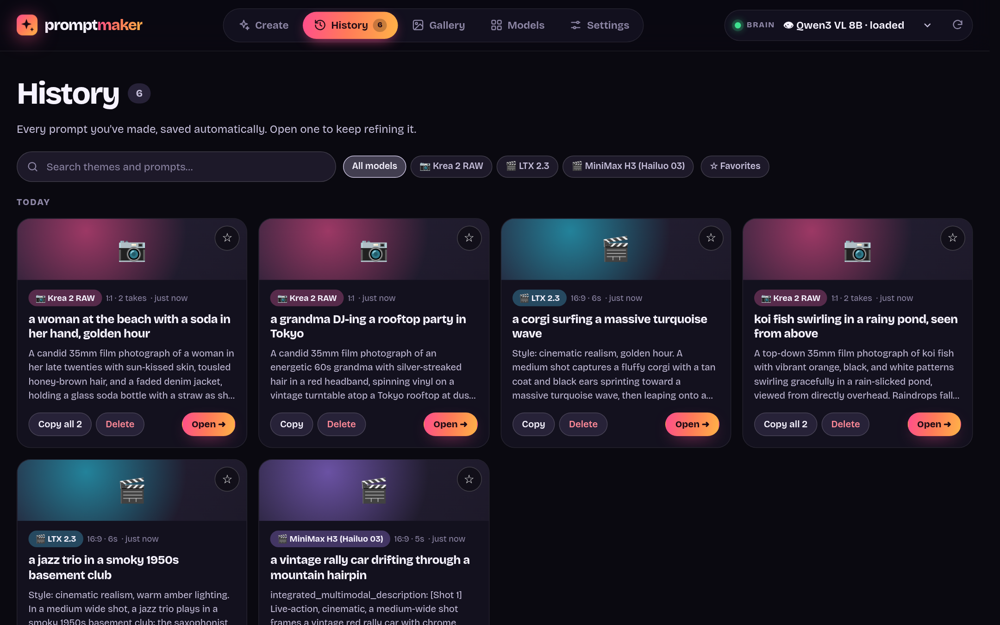
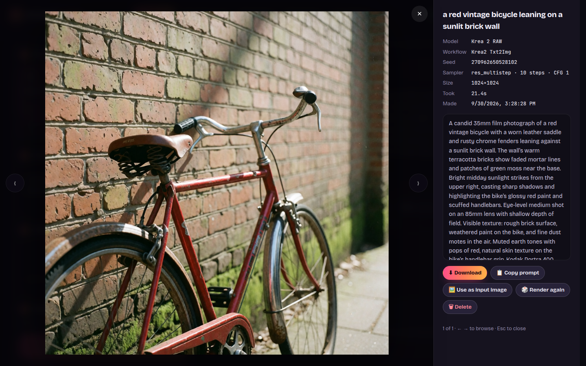

<div align="center">

# ✦ Prompt Maker

**Write the perfect prompt for any image or video model, from a theme, an image, or both. Then render it with your own ComfyUI workflows.**
Runs 100% offline on your own machine, powered by a local LLM in [LM Studio](https://lmstudio.ai) and, optionally, [ComfyUI](https://github.com/comfyanonymous/ComfyUI).


</div>

---

Every image and video model wants its prompts written differently:

- **Krea 2 RAW** likes dense, literal captions with skin-texture cues.
- **LTX 2.3** wants one flowing paragraph, with camera moves and sound written in.
- **MiniMax H3** expects a structured "shooting script" with timed shots and dialogue tags.

Prompt Maker keeps a **playbook for each model** and has a local LLM write the prompt in exactly that style. You describe the idea, and it handles the dialect. Hook up your ComfyUI workflows and each prompt is one click away from the finished image or video.

## Contents

- [Features](#features)
- [How it works](#how-it-works)
- [Requirements](#requirements)
- [Installation](#installation)
- [Quick start](#quick-start)
- [Using Prompt Maker](#using-prompt-maker)
- [Rendering with ComfyUI (optional)](#rendering-with-comfyui-optional)
- [Target models](#target-models)
- [Choosing a brain (LLM)](#choosing-a-brain-llm)
- [Settings](#settings)
- [Privacy & offline](#privacy--offline)
- [Your data](#your-data)
- [Troubleshooting](#troubleshooting)
- [Platform support](#platform-support)
- [Development](#development)
- [Contributing](#contributing)
- [Acknowledgements](#acknowledgements)
- [License](#license)

## Features

- **Theme → prompt.** Type an idea ("a woman at the beach with a soda in her hand"), pick a model, and get a finished prompt.
- **Image → prompt.** Drop in an image and use it three ways:
  - 🎯 **Reference**: borrow its look and blend it with your theme.
  - 🪞 **Recreate**: describe it so the model can reproduce it.
  - 🎬 **Animate**: video models only. The image is frame one, and the prompt describes what happens next.
- **Image alone.** Leave the theme empty and it suggests a prompt from the image.
- **Model-aware settings.** Aspect ratio, resolution, duration (video) and prompt length.
  - Uploading an image **matches the aspect ratio to it** automatically.
  - Each model remembers your last choices.
- **Takes.** Generate 1–4 variations at once. Each take deliberately goes a different way (angle, lighting, setting, moment).
- **Refine.** Tell a take what to change ("golden hour", "add a dog", "shorter") or tap a quick chip. Every version is kept and you can page through them, and hand edits are saved as versions too.
- **Live output.** Text streams in as it's written.
  - Word count against the model's ideal length (✓ when it's on target).
  - Timing for each take, plus a status while the model loads or thinks.
  - Progress shown in the browser tab title.
- **History.** Every prompt is saved automatically and grouped by day. You can search it, filter by model, star favorites, and reopen any entry to keep refining.
- **🎨 Render with ComfyUI (optional).** Attach as many ComfyUI workflows as you like to each model, then hit **▶ Render** on any take:
  - Pick any workflow you've saved in ComfyUI. Prompt Maker reads it directly, with no "Export (API)" step, and works out where the prompt, image, size, duration and seed go.
  - Watch live progress (and previews) right on the take.
  - Browse every result in the **Gallery**, and view it in a full-screen lightbox.
  - Chain models: turn a still into the input image for a video model with one click.
- **Model playbooks you own.** Add a new model, edit its instructions, or paste a model's official docs and let the local LLM draft the playbook. Import and export models as `.json`.
- **Zero install fuss.** Plain Node.js with no dependencies: no `npm install`, no build step.
- **Private by design.** Nothing leaves your machine (see [Privacy & offline](#privacy--offline)).

## How it works

```
 You (browser) ──▶ Prompt Maker (localhost:5317) ──▶ LM Studio (localhost:1234)
                    • the target model's playbook      • your local LLM ("the brain")
                    • your theme / image / settings    • writes the prompt, streamed back
                                   │
                                   └──(optional)──▶ ComfyUI (localhost:8188)
                                                     • your workflow, with the prompt dropped in
                                                     • renders the image/video on your GPU
```

Prompt Maker builds a request out of three parts and sends it to LM Studio: its shared master rules, the target model's playbook and example prompts, and your theme, image and settings. The LLM's reply streams back into the page as your prompt. When you render, Prompt Maker makes a copy of the workflow you picked, puts the prompt (plus image, size, duration and a fresh seed) into it, and queues it on your ComfyUI. The result is saved alongside the take.

## Requirements

| What | Details |
|---|---|
| **Node.js 20.11+** | [nodejs.org](https://nodejs.org). Check with `node --version`. |
| **LM Studio** | [lmstudio.ai](https://lmstudio.ai), free for macOS (Apple Silicon), Windows and Linux. |
| **A local LLM** | Any chat model works. Use a **vision** model (tagged "Vision" in LM Studio) if you want to use images. See [Choosing a brain](#choosing-a-brain-llm). |
| **Hardware** | Enough memory to run that model. A small 4–8B vision model needs roughly 4–8 GB of GPU VRAM or Mac unified memory. CPU-only works, just slowly. |
| **A modern browser** | Chrome/Edge 111+, Firefox 121+, Safari 16.2+ |
| **ComfyUI** *(optional)* | Only for rendering. Any recent [ComfyUI](https://github.com/comfyanonymous/ComfyUI) running locally (default port `8188`). Node 22+ gives live progress; older Node versions poll instead. |

## Installation

### 1. Install Node.js

- **macOS / Windows:** download the LTS installer from [nodejs.org](https://nodejs.org).
- **Linux:** use your package manager, or [nvm](https://github.com/nvm-sh/nvm): `nvm install --lts`.

### 2. Install LM Studio and get a model

1. Install [LM Studio](https://lmstudio.ai) and open it once. This also installs its `lms` command-line tool.
2. Go to the **Discover** tab (🔍) and download a vision model, for example **Qwen3-VL 8B**.
3. Turn on the local server. Any of these works:
   - In LM Studio: **Developer** tab → **Start server** (it runs on port `1234`).
   - In a terminal: `lms server start`
   - Or skip this step: Prompt Maker shows a **▶ Start it** button when the server is off.

> **Tip:** LM Studio loads a model automatically the first time it's used, so you don't have to load one by hand. The first prompt just takes a few extra seconds.

### 3. Get Prompt Maker

```bash
git clone https://github.com/VincentAZ/prompt-maker.git
cd prompt-maker
```

No git? Click **Code → Download ZIP** on GitHub and unzip it.

There's nothing to install. Prompt Maker has no dependencies.

### 4. Start it

```bash
npm start
```

Then open **http://127.0.0.1:5317** in your browser.

On **Linux** you can use the launcher instead. It starts LM Studio's server if needed, starts the app and opens your browser, and if the app is already running it just opens it:

```bash
./start.sh
```

To stop Prompt Maker, press `Ctrl+C` in the terminal.

## Quick start

1. **Pick a brain.** Use the **Brain** menu at the top right: models marked 👁 can see images, and "loaded" means it's ready right now.
2. **Pick a target model**, for example *Krea 2 RAW*.
3. **Describe the shot.** Type a theme, or hit **🎲 Surprise me**.
4. Click **Generate**, or press `Ctrl+Enter`.
5. **Copy** the prompt, or tweak it: type *"make it night time"* in the box under the take and press Enter.

## Using Prompt Maker

### Create

| Step | What it does |
|---|---|
| **① Pick your model** | The generator you're writing for. Its color follows you across the app. |
| **② Describe the shot** | Your theme: short or long, casual is fine. Optional if you add an image. |
| **③ Add an image** | Drop, paste (`Ctrl+V`) or browse. Then choose how to use it (below). |
| **④ Dial it in** | Aspect ratio, resolution, duration (video), prompt length, number of takes, temperature. |
| **⑤ Render it** | Optional, with ComfyUI. Pick the workflow that renders your takes, edit it or add one (see [Rendering](#rendering-with-comfyui-optional)). |
| **⑥ Then…** | Optional. Chain more steps, like still → video (see [Chains](#4-chains-build-your-own-pipelines)). |

**＋ New** (next to Generate) starts a new session: it clears the theme, image and takes but keeps your model and dials. **↶ Undo** brings it all back, and everything stays in History.

**Image modes**

| Mode | Use it when… | What the prompt does |
|---|---|---|
| 🎯 **Reference** | You like the image's vibe | Carries its subject, palette, lighting and mood into *your* theme. |
| 🪞 **Recreate** | You want *that* image | Describes it faithfully so the target model can reproduce it. Your theme becomes changes. |
| 🎬 **Animate** | Image-to-video (video models only) | Treats the image as the first frame and describes the motion, camera and sound from there. |

**Temperature** runs from 🎯 *precise* to 🌶️ *wild*. Lower values stick closely to your words, higher values get more inventive. Each model sets its own default.

**Prompt length** (*short / medium / long*) means something different for each model. For example, "medium" is about 70–120 words for Krea and about 160–260 for MiniMax. Every take shows its word count against that target.

### Refine and versions

- Type a change in **Tweak it…** and press Enter, or tap a chip like ✂️ *Shorter*, 🎞️ *More cinematic* or ⚡ *More dynamic motion*.
- Every refine adds a version. Page through them with **‹ ›**.
- You can edit a prompt by hand. Click **💾 Save edit**, or page away and it's saved automatically.
- **Stop** (■ or `Esc`) cancels a run but keeps any takes that already finished.

### History



Everything you generate is saved automatically:

- **Find things:** search themes and prompts, filter by model, or show only ★ favorites.
- **Pick up where you left off:** click a card to reopen it with its image and settings, and keep refining.

### Keyboard shortcuts

| Keys | Action |
|---|---|
| `Ctrl` / `⌘` + `Enter` | Generate |
| `Esc` | Stop the current run |
| `Enter` (in *Tweak it…*) | Refine that take |
| `Ctrl` / `⌘` + `V` | Paste an image |

## Rendering with ComfyUI (optional)



Prompt Maker is great on its own. If you run [ComfyUI](https://github.com/comfyanonymous/ComfyUI), it can also **render** your prompts, using your own workflows on your own GPU.

### 1. Attach a workflow to a model

1. Start ComfyUI as usual. Prompt Maker expects it at `http://127.0.0.1:8188`; change that in **Settings → ComfyUI**.
2. On **Create**, pick a model (say *Krea 2 RAW*) and click **＋ Add workflow** in step ⑤. (Or do it in **Models**, which lists every model's workflows.)
3. Choose where the workflow comes from:
   - **From ComfyUI** lists every workflow you've saved in ComfyUI. Click one.
   - **Upload a file** accepts a saved workflow, an *Export (API)* file, or a workflow exported from Prompt Maker.
4. Check the **setup**. Prompt Maker reads the workflow and suggests where things go:

   | Slot | What Prompt Maker puts there |
   |---|---|
   | ✍️ **Prompt** | The take's prompt. It picks the text that feeds the sampler's *positive* input, never the negative. You can send it to several inputs. |
   | 🖼️ **Image** | The take's image, uploaded to ComfyUI (for image-to-image or image-to-video). |
   | 📐 **Size** | Width and height from the take's resolution and aspect, rounded to a multiple of 8/16/32/64. An *aspect ratio* input gets its closest option. |
   | ⏱️ **Duration** | Seconds, or a frame count worked out from the frame rate (with 8n+1 or 4n+1 rounding for LTX and Wan-style models). |
   | 🎲 **Seed** | A fresh random seed every render, unless you lock it. |

   Anything you don't map stays exactly as the workflow has it. Add as many workflows per model as you like, for example a fast draft workflow and a slow hi-res one.

5. Tune the **🎛️ Sampler** settings if you like. Prompt Maker shows the workflow's own **seed, steps, CFG, sampler and scheduler** (every sampler in it, two-stage ones included) and lets you change any of them; **↺** puts a value back.
   - A **CFG of 1 is locked**, because distilled, turbo and lightning models need it. **🔒 unlock** is there if you really mean it.
   - Leave *New random seed every render* on, or turn it off to use a fixed seed.

**Changed a workflow in ComfyUI?** Prompt Maker renders from its own copy, saved when you added the workflow. When you save the workflow again in ComfyUI, Prompt Maker notices (next time you come back to its tab) and shows **↻ Changed in ComfyUI · Update** in step ⑤, on the take's render bar and in **Models**. One click pulls in the new version and keeps your setup: where the prompt goes, the size and seed slots, and your sampler tweaks. If a part of your setup no longer fits (say the prompt node was replaced), the setup opens so you can check it. **↻ Update from ComfyUI** in a workflow's setup does the same any time. Workflows you uploaded as files offer **↻ Update from a file** instead.

### 2. Render

Step **⑤ Render it** on the Create page is your control center:

- **Pick the workflow** your takes render with. Prompt Maker remembers it for each model.
- **⚙ Edit** changes its name, inputs and sampler settings; the chips under it show what it will use (sampler, steps, CFG, seed), and clicking them jumps to those settings. **＋** adds another workflow. **Delete workflow** is in the edit dialog.
- **Auto-render every new prompt** sends each new or refined take to ComfyUI as soon as it's written.

Every take also has a **🎨 Render** bar:

- **The workflow menu** is the same choice as step ⑤; change either one. **⚙** opens its sampler settings.
- **×1–×4**: render several at once, each with its own seed.
- **🎲 New seed / 🔒 Seed**: lock the last seed to try prompt tweaks on the same composition.
- **▶ Render**: live progress shows on the tile (queue position, node, step, %), with previews if ComfyUI was started with `--preview-method auto`. **✕** cancels.
- **🎨 Render all** does every take in one go.

Click any result to open the **lightbox**, where you can:
- see the prompt, seed, size and timing,
- **download** the file,
- **render again** with a new seed,
- **🎬 Animate this** (see below), or **🖼️ use it as the input image** for your next prompt,
- or delete it.

### 3. Turn a still into a video

Hover any still you rendered and click **🎬 Animate** (it's also in the lightbox):

- **The still becomes the first frame.** Create switches to your video model (the one you used last) and picks 🎬 *Animate*. The theme box asks **what happens**. Leave it empty and the AI picks fitting motion.
- **It stays consistent.** The LLM sees the frame and also gets the still's prompt, so people, clothes and places are described the same way.
- **Full quality.** ComfyUI gets the original render file as the first frame, not a re-compressed copy.
- **It remembers where it came from.** The video's results, History card and lightbox link back with **⬑ from Krea 2 RAW · take 1 · seed …**.

You'll need an image-to-video workflow (one with a *Load Image* node) on the video model. Step ⑤ warns you if the picked workflow can't take the frame.

### 4. Chains: build your own pipelines

A chain runs several steps in a row, each one continuing from the renders of the step before, like a still that becomes a video. Build it in step **⑥ Then…** on the Create page:

1. Set up step 1 as usual (model, theme, dials, and a workflow in step ⑤).
2. Click **＋ Then…** to add a step. Pick its model, how it uses the image (🎬 *first frame*, *reference* or *recreate*), **what happens** (optional; empty lets the AI choose), its workflow, takes and renders.
3. Between steps, choose **⏸️ Let me pick** (the chain waits while you pick the best renders) or **⚡ Auto** (every render goes on).
4. Click **Run chain**. The line above it says what you'll get, e.g. *2 stills → you pick → videos*.

While a chain runs, a strip above the results shows every step. Click any thumbnail to see that step's takes.

- **At a ⏸️ step,** tick **☐ Pick** on the renders you like and click **Continue ▶**. Pick several to make one video from each.
- **Change a step while you pick,** for example what happens next. Continue uses the chain as you see it.
- **Stop (■ or Esc)** ends the chain. Finished steps are kept.
- **Reopen a run any time from History.** Its cards are marked ⛓. You can send more stills on from it later.

**💾 Save as a chain** keeps your steps, so you can run them again with a new idea. Saved chains show up under the steps, next to the starter chains *Still → Video* and *One still, 3 motions*. **⤒** exports one to share, and **⤓ Import** adds one from a file. A chain from someone else picks your matching workflows by name, or asks you to choose.

> Chains continue from images for now: a video can't feed the next step yet. Extending a clip from its last frame is coming next.

Every render also appears in the **Gallery** tab, with filters for images, videos and models. The newest render becomes the thumbnail of its History card.

> **Tip:** if a workflow runs its own prompt-writing LLM node (some LTX workflows do), Prompt Maker warns you during setup. Its prompt is already written for the model, so you may want that node off.

## Target models

Three models come with ready-made playbooks, researched from their official prompting guides (September 2026):

| Model | Type | Prompt style |
|---|---|---|
| **Krea 2 RAW** | Image | Dense, literal natural-language captions. Medium and shot first; skin texture and restrained color to avoid the "airbrushed" look. |
| **LTX 2.3** | Video + audio | One chronological paragraph: shot, subject, action beats, explicit camera, and ambience, sound effects and dialogue woven in. |
| **MiniMax H3 (Hailuo 03)** | Video + audio | MiniMax's structured shooting-script format (`integrated_multimodal_description` / `overall_soundscape` / `non_diegetic_music`) with `[Shot N]` cuts and `(S1)` dialogue tags. |

> **Good to know**
> - Krea recommends *Krea 2 Turbo* for everyday generation. RAW is the undistilled base model, mainly meant for training.
> - If you run MiniMax H3 through a host that rewrites prompts (for example fal.ai's prompt expansion), turn that off so the structured format arrives intact.
> - Each model's sources are listed in its editor.

### Adding or updating a model


New models come out constantly. Open the **Models** tab and:

- **＋ New model** (or **Duplicate** a similar one), then fill in:

  | Field | What it's for |
  |---|---|
  | **Instructions** | The playbook: prompt structure, vocabulary that works, things to avoid, how to use an attached image. Markdown. |
  | **Example prompts** | 2–4 gold-standard prompts. The LLM copies their *style*, never their content. |
  | **Aspect ratios / resolutions / durations** | The options shown on the Create page. |
  | **Defaults** | Starting aspect, resolution, duration, length and temperature. |
  | **Length guide** | What *short / medium / long* mean for this model, e.g. `≈70–120 words`. |
  | **Color** | Its accent color in the app. |

- **✨ Draft the instructions from pasted docs:** paste the model's official prompting guide (or a good community write-up) and your local LLM turns it into a playbook in the standard format. Review it, then click **Use this draft**.
- **Import / Export:** share models as `.json`. Importing a model with an existing ID updates it, which is handy when someone publishes an improved playbook.

- **Built-in vs. yours:** the playbooks that ship with the app live in `playbooks/` and are never modified. When you edit one, your copy is saved in your [data folder](#your-data) and used instead. **↺ Reset to built-in** drops your copy. If you delete a built-in, a **↺ Bring back** button appears under the model list.

Each model is a single `.json` file (built-ins in `playbooks/<id>.json`, yours in `models/<id>.json` inside your data folder):

```jsonc
{
  "id": "ltx-2-3",
  "name": "LTX 2.3",
  "kind": "video",                       // "image" or "video"
  "description": "One line shown under the model picker",
  "color": "#22d3ee",
  "instructions": "## Prompt format\n- Write ONE flowing paragraph…",
  "examples": ["A complete example prompt…"],
  "aspectRatios": ["16:9", "9:16", "1:1"],
  "resolutions": ["1920×1080", "1080×1920", "1024×1024"],
  "durations": ["6s", "8s", "10s"],
  "defaults": { "aspectRatio": "16:9", "resolution": "1920×1080", "duration": "6s", "temperature": 0.7, "length": "medium" },
  "lengthGuide": { "short": "≈50–90 words", "medium": "≈100–170 words", "long": "≈170–250 words" },
  "sources": ["https://…"]
}
```

## Choosing a brain (LLM)

The "brain" is the LM Studio model that writes your prompts. Pick it from the **Brain** menu at the top right:

- **👁 vision** models can see images. Text-only models still work for themes, and the app tells you if you try to use an image with one.
- **Bigger follows the playbooks better,** especially exact length and structured formats like MiniMax's. Smaller is faster.

| Your hardware | Good starting point |
|---|---|
| 6–8 GB VRAM, or a 16 GB Mac | Qwen3-VL 4B–8B |
| 12–24 GB VRAM, or a 32 GB+ Mac | Qwen3-VL 8B, Gemma 3/4 12B–27B, Qwen 3.5/3.6 (vision variants) |
| 24 GB+ VRAM | 27B–35B vision models for the best playbook-following |

> **Reasoning ("thinking") models** such as Qwen 3.5/3.6 can spend thousands of tokens thinking before they write. Prompt Maker turns thinking **off** by default (**Settings → Thinking**), which makes them answer in seconds instead of minutes.

## Settings

| Setting | Default | What it does |
|---|---|---|
| **LM Studio URL** | `http://127.0.0.1:1234` | Where LM Studio's server lives. Only this computer or local-network addresses are allowed. |
| **ComfyUI URL** | `http://127.0.0.1:8188` | Where ComfyUI lives (optional, for rendering). Local addresses only. |
| **Thinking** | Off | Reasoning effort for "thinking" models: off, low, medium, high, or the model's default. |
| **Top P** | 0.95 | Nucleus sampling. Temperature is set for each run on the Create page. |
| **Max tokens** | 4096 | The cap on each answer. Raise it if you turn thinking on. |
| **Master instructions** | built-in | Shared rules sent before every model's playbook (output format, faithfulness to your theme…). There's a **Reset to default** button. |

**Environment variables** (optional):

| Variable | Default | Purpose |
|---|---|---|
| `PORT` | `5317` | Port for the web app. |
| `HOST` | `127.0.0.1` | Interface to bind. ⚠️ There's no login, so don't expose it to a network you don't trust. |
| `PROMPT_MAKER_DATA` | [per-user data folder](#your-data) | Where your settings, history, images, renders, workflows and playbooks are stored. |
| `LMS_BIN` | `~/.lmstudio/bin/lms` | Path to LM Studio's `lms` tool, used by the **▶ Start it** button. |

## Privacy & offline

- **Everything runs on your machine.** The app talks only to your own LM Studio, and to your own ComfyUI if you render.
- **It refuses anything else.** The LM Studio URL must be this computer or a local-network address; internet URLs are rejected.
- **Nothing external loads.** The page's Content-Security-Policy blocks external scripts, fonts and trackers, and the fonts are bundled.
- **Nothing is sent anywhere.** No accounts, no telemetry, no analytics.
- **Localhost only by default.** The web server binds to `127.0.0.1`, so other devices can't reach it.
- **Protected from websites you visit.** Requests from other websites (cross-site requests) and DNS-rebinding tricks are rejected, so a web page can't quietly drive your local Prompt Maker.

## Your data

Everything personal lives in a per-user data folder, **outside the app folder**, so none of it can end up in git, and updating or re-cloning the app never touches it:

| System | Data folder |
|---|---|
| Linux | `~/.local/share/prompt-maker` (or `$XDG_DATA_HOME/prompt-maker`) |
| macOS | `~/Library/Application Support/Prompt Maker` |
| Windows | `%APPDATA%\Prompt Maker` |

Set `PROMPT_MAKER_DATA` to use another folder. **Settings** shows the folder in use.

```
<data folder>/
├── settings.json   # your settings, including your master instructions
├── history.json    # every generation, its versions and its renders
├── images/         # images you've used (deduplicated)
├── renders/        # images and videos rendered with ComfyUI
├── workflows/      # ComfyUI workflows you've attached, with their setup
├── chains/         # chains you saved or edited
└── models/         # playbooks you added or edited
```

- **The app folder is read-only to the app.** The only playbooks in it are the built-ins in `playbooks/`.
- **Back up the data folder** to keep everything.
- **Upgrading from an older version?** Older versions kept data in `./data` inside the app folder. It moves to the data folder automatically the first time you start the new version.

## Troubleshooting

<details>
<summary><b>"LM Studio's server is off" banner</b></summary>

Nothing is answering on the LM Studio URL. Click **▶ Start it** in the banner; it runs `lms server start`, which works whether the LM Studio app is open or not. The app reconnects on its own as soon as the server is back.

Keep in mind that **opening** the LM Studio app doesn't turn its server on, unless "start server on launch" is enabled in its Developer tab. **Quitting** the app turns the server off.
</details>

<details>
<summary><b>"This brain can't see images"</b></summary>

The selected LLM is text-only. Pick a model marked 👁 in the **Brain** menu, or remove the image.
</details>

<details>
<summary><b>"The brain ran out of room" / empty prompt</b></summary>

The model used up all its tokens, usually by thinking. Set **Settings → Thinking** to *Off*, or raise **Max tokens**.
</details>

<details>
<summary><b>The Brain menu is empty right after starting LM Studio</b></summary>

LM Studio takes a few seconds to index your models after its server starts. Prompt Maker keeps checking and fills the menu in on its own.
</details>

<details>
<summary><b>Prompts come out too long or too short</b></summary>

Small models often overshoot "short". Try a bigger brain, or adjust that model's **length guide** in the Models tab. The word counter on each take shows how close you are.
</details>

<details>
<summary><b>The first prompt is slow</b></summary>

LM Studio is loading the model into memory; the take shows "Loading … into memory". After that, runs are fast. With an 8B model on a GPU, expect a few seconds per take.
</details>

<details>
<summary><b>Port 5317 is already in use</b></summary>

Another copy is probably running. Open http://127.0.0.1:5317, or start on another port with `PORT=5400 npm start` (Windows PowerShell: `$env:PORT=5400; npm start`).
</details>

<details>
<summary><b>"Can't reach ComfyUI"</b></summary>

Start ComfyUI (for example `python main.py` in its folder) and check the URL in **Settings → ComfyUI → Test connection**. The render bar shows *ComfyUI offline* while it's down, and reconnects on its own.
</details>

<details>
<summary><b>"This workflow uses nodes your ComfyUI doesn't have"</b></summary>

The workflow needs custom nodes that aren't installed. In ComfyUI, open **Manager → Install Missing Custom Nodes**, restart, then add the workflow again.
</details>

<details>
<summary><b>A workflow doesn't convert or render quite right</b></summary>

Prompt Maker converts saved workflows itself. It handles bypassed nodes, reroutes, primitives, subgraphs and so on, and was checked against ComfyUI's own conversion on real workflows. A few exotic custom widgets can still differ. If one misbehaves, export it from ComfyUI with **Workflow → Export (API)** and upload that file instead.
</details>

<details>
<summary><b>"This workflow needs an image"</b></summary>

The workflow has a Load Image node mapped as the image input, but the take has no image. Add an image on the Create page, or pick a text-to-image/video workflow.
</details>

## Platform support

| | Linux | macOS | Windows |
|---|---|---|---|
| The app (`npm start`) | ✅ tested | ✅ should work | ✅ should work |
| `./start.sh` launcher | ✅ | ⚠️ needs `open` instead of `xdg-open` | ❌ use `npm start` |
| **▶ Start it** (LM Studio server) | ✅ | ✅ should work | ⚠️ start the server from LM Studio instead |
| Test suite | ✅ | ⚠️ expects Chrome as `google-chrome` | ⚠️ same |

Developed and tested on Linux with Chrome. Reports from macOS, Windows, Firefox and Safari are welcome.

## Development

No build step: edit a file and refresh the browser (restart the server after changing `server.js` or `lib/`).

```
prompt-maker/
├── server.js               # HTTP server: API, streaming, static files
├── lib/
│   ├── lmstudio.js         # LM Studio client: model list, streaming chat, start server
│   ├── prompt.js           # builds the messages sent to the LLM (master rules + playbook + request)
│   ├── store.js            # file storage in your data folder: models, settings, history, images, renders
│   ├── comfy.js            # ComfyUI client: status, saved workflows, queue, live progress, downloads
│   ├── comfy-convert.js    # saved (editor) workflows → API format, incl. subgraphs & bypass
│   └── workflows.js        # attached workflows: auto-mapping and building the prompt to queue
├── public/                 # the web app (plain HTML/CSS/JS, bundled fonts)
├── playbooks/              # the built-in model playbooks (read-only to the app)
├── chains/                 # the starter chains (read-only to the app)
├── tests/
│   ├── mock-lmstudio.mjs   # fake LM Studio for tests
│   ├── mock-comfyui.mjs    # fake ComfyUI (HTTP + WebSocket progress) for tests
│   └── ui.test.mjs         # end-to-end suite (headless Chrome)
└── start.sh                # Linux launcher
```

### Tests

```bash
npm run test:ui
```

The suite runs the real app against a mock LM Studio and a mock ComfyUI in headless Chrome, and uses a temporary data folder so your models and history are never touched:

- **Real clicks:** it uses real mouse events, so a button hidden under something else fails.
- **Coverage:** generating, refining, versions, images, errors, stopping, History, Models, Settings, keyboard use, ComfyUI workflows, rendering, the Gallery and security checks.
- **Strict:** it fails on any console error.
- **Layout:** it checks for sideways scrolling at six screen sizes, from 360px phones to 1920px desktops.

Screenshots go to `/tmp/prompt-maker-ui/` (or `$SHOTS`). The suite needs Node 22+ and Chrome installed as `google-chrome`.

## Contributing

Issues and pull requests are welcome. The most valuable contributions are **model playbooks**: if you've dialed in prompting for a model, export its `.json` and share it. Please keep the app dependency-free and offline-only, and run `npm run test:ui` before opening a PR.

## Acknowledgements

- [LM Studio](https://lmstudio.ai), for making local LLMs easy.
- [ComfyUI](https://github.com/comfyanonymous/ComfyUI), for being the best local rendering engine there is.
- The prompting guides from **Krea**, **Lightricks (LTX)** and **MiniMax** that the bundled playbooks are built on (sources are in each model's editor).
- Fonts: [Bricolage Grotesque](https://github.com/ateliertriay/bricolage) and [JetBrains Mono](https://github.com/JetBrains/JetBrainsMono), both under the SIL Open Font License (`public/fonts/OFL.txt`).

## License

[MIT](LICENSE) © 2026 VincentAZ. Bundled fonts are under the SIL Open Font License (`public/fonts/OFL.txt`).
