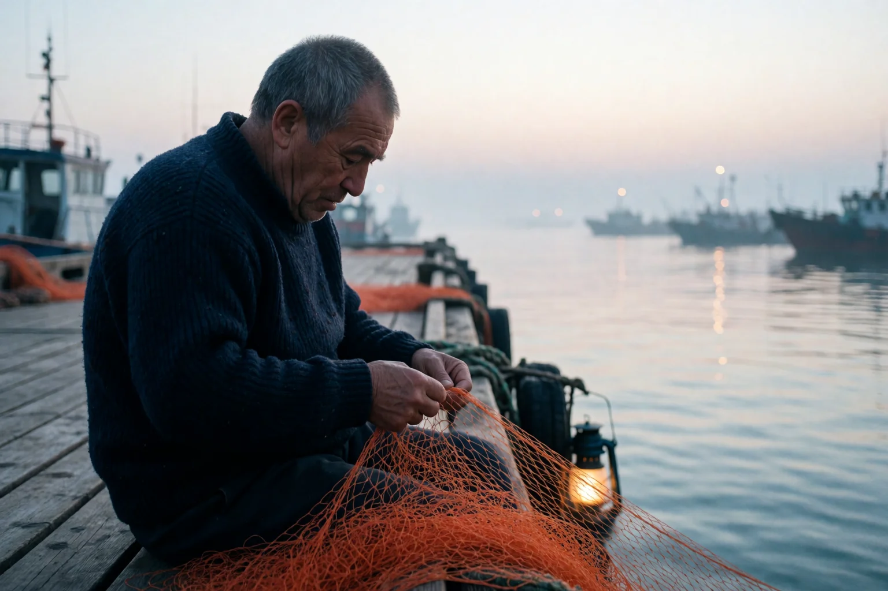
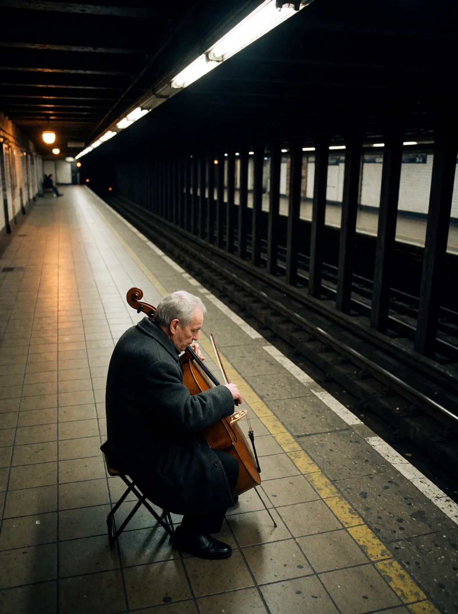
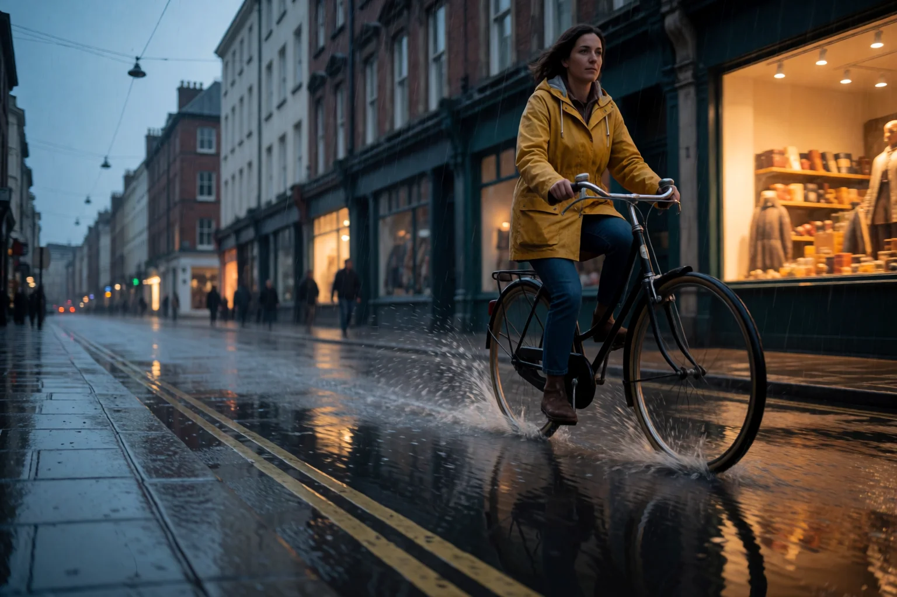
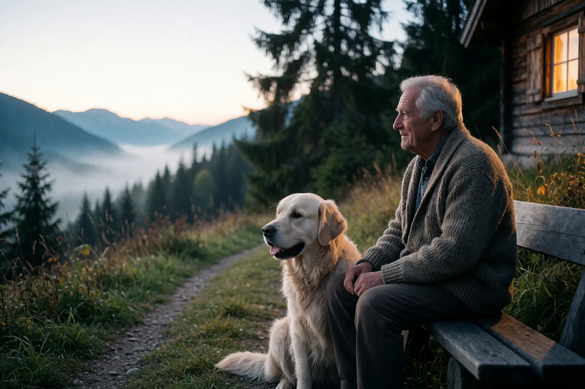
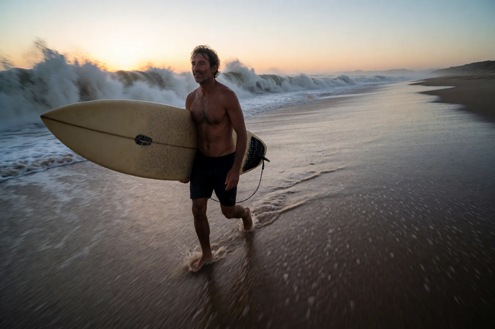
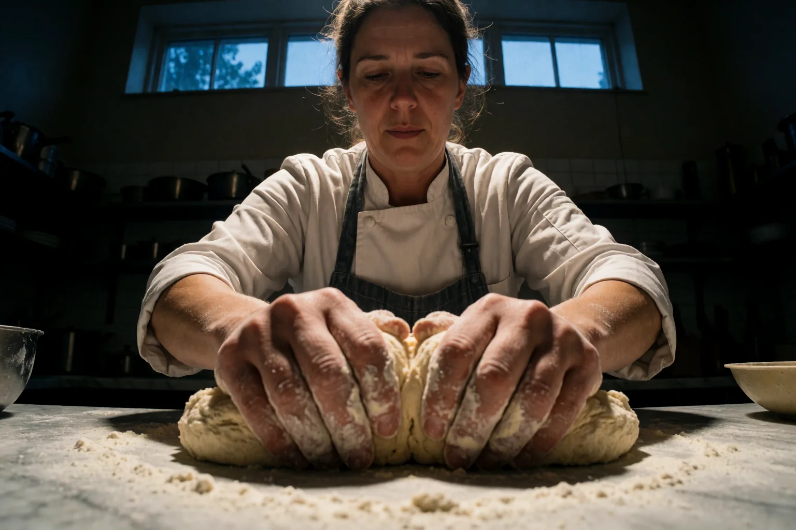
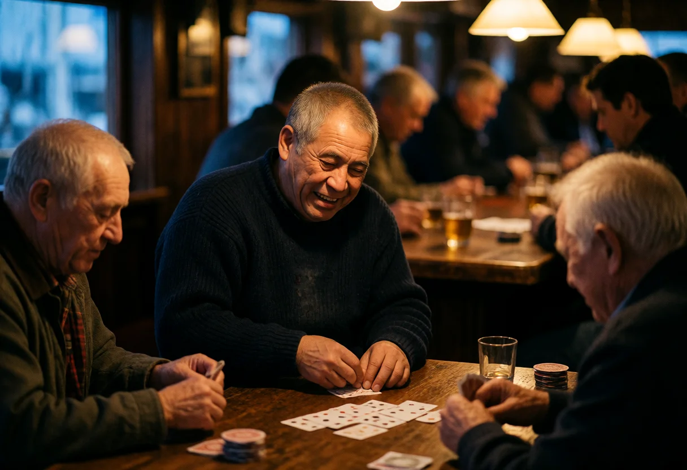
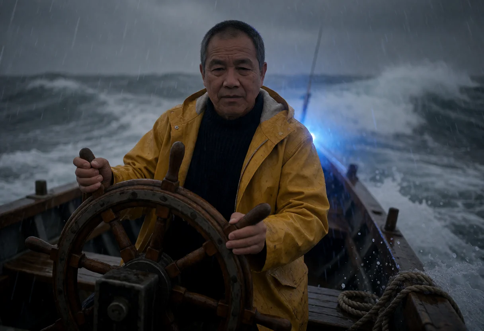
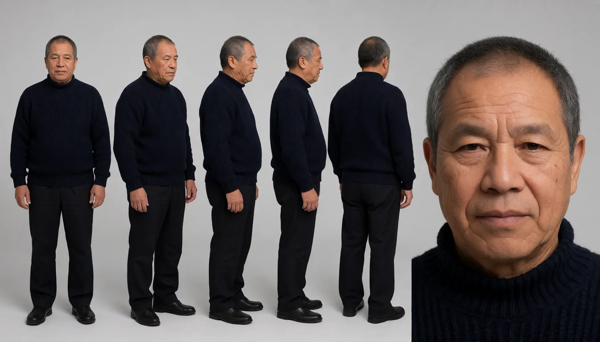
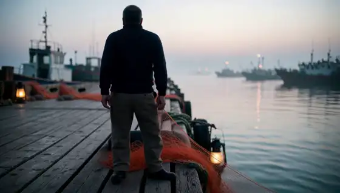

# ✦ Prompt Maker

**Say what you want to see, in plain words, and get pictures and videos made on your own computer.**
Start from an idea, a photo, or both. It writes for each model the way that model likes, keeps the same person from shot to shot and gives them a voice. Keep the ones you love, compare them side by side, find them again later. Seven models are ready to go, more are on the way, and you can add your own. Nothing leaves your machine, and it's free.

**One man, four scenes, 22 seconds.** Made here, on one computer. [Watch it with sound](docs/renders/film-fisherman.mp4).

---

## Made with Prompt Maker

Every picture and clip below was made on one home computer with Prompt Maker, ComfyUI and free models. No retouching.

<table>
<tr>
<td></td>
<td></td>
<td></td>
</tr>
<tr>
<td></td>
<td></td>
<td></td>
</tr>
<tr>
<td></td>
<td></td>
<td></td>
</tr>
</table>

You don't write the long, technical prompts these models want. You type a few words and the **Brain** (an AI model running on your computer) writes the prompt for you, in the way each model likes best.

## What you get

- **Pictures and videos from a few words, or from your own photo.** Pick a model, say what you want to see, press Generate. Four takes at a time if you like, each deliberately different.
- **The same person in every shot.** Drop in one picture of someone and they stay themselves in new places, new light, new scenes. See below.
- **Clips that carry on.** Turn any still into a video, then the next scene from the next still, and join them. The film above is four of these.
- **A voice for your character.** Describe a voice in plain words, hear it, keep it by name and have your character say a line in a video.
- **Your best work stays findable.** Every render lands in one grid that never forgets. Rate them, put two side by side, hide the ones you don't want, search your history.
- **A creative partner.** The ✦ Assistant looks at your renders, picks the better one and tells you why, and can run a whole batch while you're away.
- **Nothing leaves your computer.** No account, no cloud, no tracking.

## The same person, every shot

One picture of a man on a dock. Prompt Maker writes down who he is, then every new picture and video keeps him: the same face, the same sweater, in a bar, in a storm, walking home.

<table>
<tr>
<td></td>
<td></td>
<td></td>
</tr>
</table>

One click on **🪪 Turnaround** gives you the same person from every side, so later shots hold up from any angle.

## From a picture to a video

<table>
<tr>
<td></td>
<td></td>
<td></td>
</tr>
<tr>
<td align="center">A still comes to life</td>
<td align="center">A character speaks (his line is part of the clip)</td>
<td align="center">Moves copied from any video</td>
</tr>
</table>

These are short previews without sound; click one to watch the video (the first two have sound). Wan Animate 2 makes your character perform the moves of any video you give it; the clip above follows a ten-second silhouette video from start to end.

## Get it

**1. Prompt Maker**

- **Ubuntu or Debian, one click:** download `prompt-maker_<version>_amd64.deb` from the [releases page](https://github.com/VincentAZ/prompt-maker/releases) and double-click it. It brings its own Node.js and puts **Prompt Maker** in your app menu.
- **Any other computer:** install [Node.js](https://nodejs.org) 20.11 or newer, then `git clone https://github.com/VincentAZ/prompt-maker.git`, go into the folder and run `npm start`. Details for each system are in the [guide](docs/guide.md#installation).

**2. LM Studio** (free, it runs the Brain). Install [LM Studio](https://lmstudio.ai), download a model, and Prompt Maker finds it. A vision model (marked 👁) lets you use your own pictures.

**3. ComfyUI** (free, it makes the pictures and videos). On Linux, open **Settings → Services → ⬇ Set up ComfyUI** and Prompt Maker checks your graphics card, downloads and installs it, and starts it. On other systems install [ComfyUI](https://github.com/comfyanonymous/ComfyUI) yourself; Prompt Maker hooks into it. Without ComfyUI you still get the prompts to use anywhere.

Everything runs on your own computer and talks only to your own LM Studio and ComfyUI; nothing is loaded from the internet. What stays on the computer, and for how long, is yours to set in Settings → Privacy check ([details](docs/guide.md#privacy--offline)).

You need a computer with a good graphics card. Linux is where it's tested every day. On Windows the launcher is written but has **not yet been tried on a real Windows PC**; if something doesn't work there, please tell us.

Seven models are ready: **Krea 2 RAW** (text to image, image to image, and a Character version that keeps the same person), **LTX 2.3**, **MiniMax H3** (and a Reference version for your person) and **Wan Animate 2**. [Add your own](docs/guide.md#adding-or-updating-a-model).

## More

**[The full guide](docs/guide.md)** covers every page, setting and trick: Create, Voices, the Assistant, rendering with ComfyUI, chains, the Gallery, choosing a Brain, your data, troubleshooting and development.

## Contributing

Issues and pull requests are welcome. The most valuable contributions are **model playbooks**: if you've dialed in prompting for a model, export its `.json` and share it. A workflow that ships in `workflows/` must carry nobody's data: empty prompts (positive and negative), seed 0, `example.png` as its picture, only ComfyUI's own nodes where possible, and a Hugging Face link for every model file (the test suite checks this). Please keep the app dependency-free and offline-only, and run `npm run test:ui` before opening a PR. Contributions are accepted under the project's [license](#license). More in the [guide](docs/guide.md#development).

## Acknowledgements

- [LM Studio](https://lmstudio.ai), for making local AI models easy.
- [ComfyUI](https://github.com/comfyanonymous/ComfyUI), for being the best local rendering engine there is.
- The prompting guides from **Krea**, **Lightricks (LTX)**, **MiniMax** and **Wan-AI** that the bundled playbooks are built on (sources are in each model's editor).
- Fonts: [Bricolage Grotesque](https://github.com/ateliertriay/bricolage) and [JetBrains Mono](https://github.com/JetBrains/JetBrainsMono), both under the SIL Open Font License (`public/fonts/OFL.txt`).
- The silhouette motion video behind the Wan Animate 2 clip is from [Pixabay](https://pixabay.com).

## License

[Functional Source License 1.1, Apache 2.0 future license](LICENSE) (FSL-1.1-ALv2) © 2026 Serpico Enterprises LLC. Bundled fonts are under the SIL Open Font License (`public/fonts/OFL.txt`).

In plain words: use it, change it and share it for anything, including paid work made with it (your images and videos are yours). What you can't do is sell Prompt Maker, or a copy of it under another name, as a competing product or service. Two years after each version comes out, that version also becomes Apache 2.0, with no limits.

Versions up to and including 1.21.0 were released under the MIT license and stay MIT.
